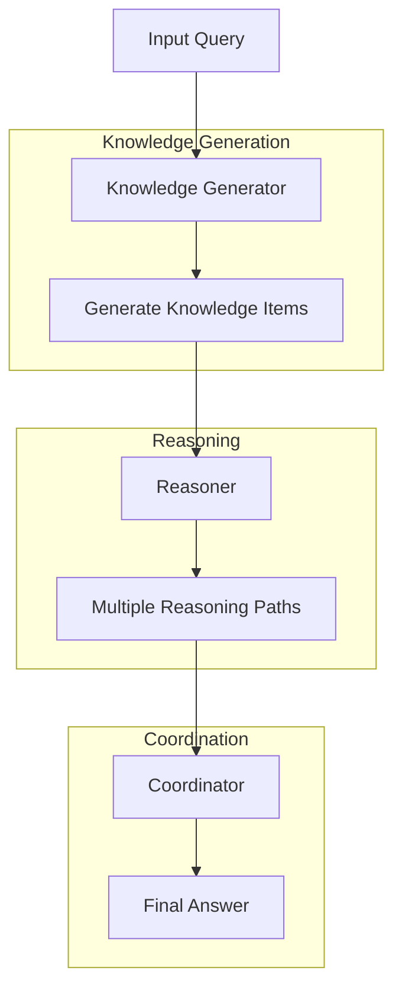

The GKP Agent enhances its reasoning by generating relevant knowledge before answering queries. This approach, inspired by [Liu et al. 2022](https://arxiv.org/abs/2110.08387), is particularly effective for tasks requiring commonsense reasoning and factual information.

The agent consists of three main components:

1. **Knowledge Generator** — Creates relevant factual information
2. **Reasoner** — Uses generated knowledge to form answers
3. **Coordinator** — Synthesizes multiple reasoning paths into a final answer

## Architecture



## API Reference

### GKPAgent

| Parameter | Type | Default | Description |
|-----------|------|---------|-------------|
| `agent_name` | `str` | `"gkp-agent"` | Name identifier for the agent. Components are named `<agent_name>-knowledge-generator`, `<agent_name>-reasoner` and `<agent_name>-coordinator` |
| `model_name` | `str` | `"openai/o1"` | LLM model to use for all components |
| `num_knowledge_items` | `int` | `6` | Number of knowledge snippets to generate per query |

| Method | Parameters | Returns |
|--------|------------|---------|
| `process(query)` | `query: str` | `Dict[str, Any]` — full processing results |
| `run(task)` | `task: str` | `str` — the final answer to a single task |
| `__call__(task)` | `task: str` | `str` — alias for `run(task)` |

`run()` only accepts a single task string (it internally calls the private `_run([task])[0]`). There is no public batch-processing method that accepts a list of tasks; process each task with a separate `run()` call if you need to handle multiple queries.

`process(query)` makes one knowledge call, one reasoner call per knowledge item (one after another), and one coordinator call, so a query costs `num_knowledge_items + 2` model calls. It returns:

| Key | Type | Description |
|-----|------|-------------|
| `query` | `str` | The query |
| `knowledge_items` | `List[str]` | The generated knowledge statements. Missing items are padded with empty strings, so the list always has `num_knowledge_items` entries |
| `reasoning_results` | `List[Dict[str, str]]` | One dict per knowledge item, with `explanation`, `confidence`, `answer` and `knowledge` |
| `final_answer` | `Dict[str, str]` | The coordinator's `analysis`, `response` and `explanation`. `run()` returns `final_answer["response"]` |
| `process_time` | `float` | Seconds the query took |

Each query and its final answer are also added to `agent.conversation`.

### KnowledgeGenerator

`KnowledgeGenerator` and `Reasoner` are not exported from `swarms`. Import them with `from swarms.agents.gkp_agent import KnowledgeGenerator, Reasoner`.

| Parameter | Type | Default | Description |
|-----------|------|---------|-------------|
| `agent_name` | `str` | `"knowledge-generator"` | Name identifier |
| `description` | `str` | `"Generates factual, relevant knowledge to assist with answering queries"` | Accepted but not used |
| `model_name` | `str` | `"openai/o1"` | Model for knowledge generation |
| `num_knowledge_items` | `int` | `2` | Number of knowledge items to generate per query |

| Method | Parameters | Returns |
|--------|------------|---------|
| `generate_knowledge(query)` | `query: str` | `List[str]` — generated knowledge statements |

### Reasoner

| Parameter | Type | Default | Description |
|-----------|------|---------|-------------|
| `agent_name` | `str` | `"knowledge-reasoner"` | Name identifier |
| `model_name` | `str` | `"openai/o1"` | Model for reasoning |

| Method | Parameters | Returns |
|--------|------------|---------|
| `reason_and_answer(query, knowledge)` | `query: str`, `knowledge: str` | `Dict[str, str]` — explanation, confidence, answer |

## Example

```python
from swarms import GKPAgent

agent = GKPAgent(
    agent_name="gkp-agent",
    model_name="claude-sonnet-4-6",
    num_knowledge_items=6,
)

query = "What are the implications of quantum entanglement on information theory?"

result = agent.run(query)

print(f"Query: {query}")
print(f"Answer: {result}")
```

## Best Practices

1. **Knowledge Generation**: Set appropriate number of knowledge items based on query complexity
2. **Reasoning Process**: Ensure diverse reasoning paths for complex queries. Validate confidence levels.
3. **Coordination**: Review coordination logic for complex scenarios. Validate final answers against source knowledge.

## Performance Considerations

- Processing time increases with number of knowledge items
- Complex queries may require more knowledge items
- Consider caching frequently used knowledge
- Monitor token usage for cost optimization
