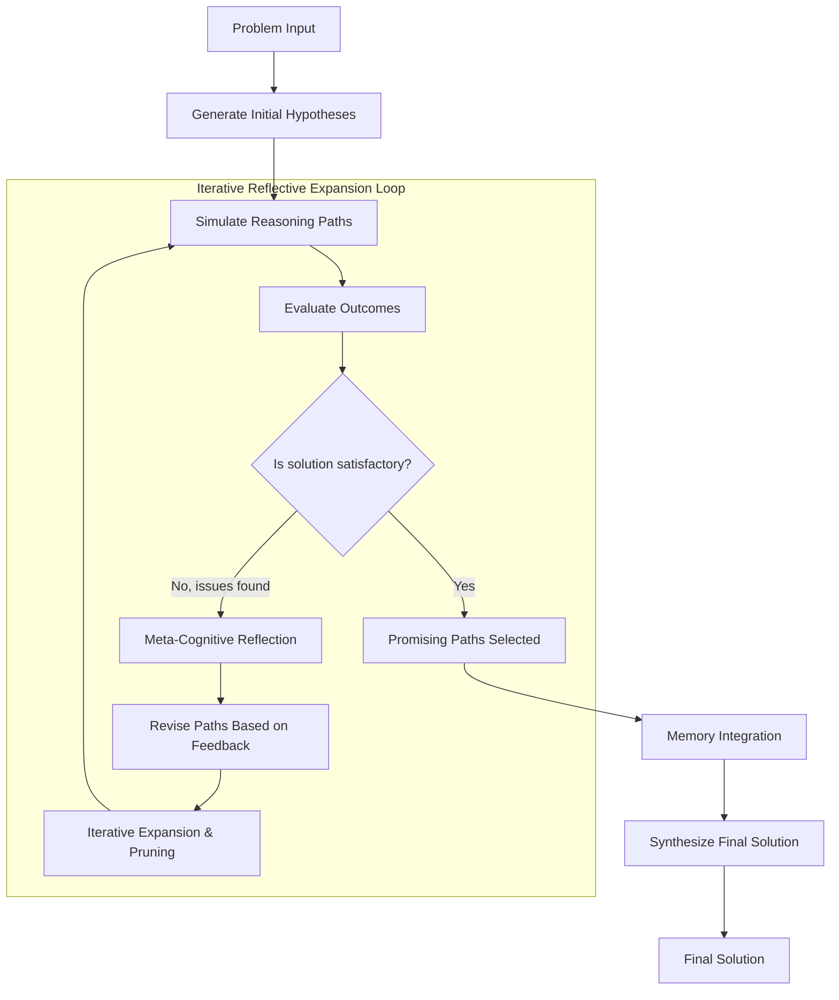

The Iterative Reflective Expansion (IRE) Algorithm is a sophisticated reasoning framework that employs iterative hypothesis generation, simulation, and refinement to solve complex problems. It leverages a multi-step approach where an AI agent generates initial solution paths, evaluates their effectiveness through simulation, reflects on errors, and dynamically revises reasoning strategies.

## Architecture



## Workflow

1. Generate initial hypotheses
2. Simulate paths
3. Reflect on errors
4. Revise paths
5. Select promising paths
6. Synthesize solution

## Class: `IterativeReflectiveExpansion`

### Parameters

| Parameter | Type | Default | Description |
|-----------|------|---------|-------------|
| `agent_name` | `str` | `"General-Reasoning-Agent"` | Name of the internal reasoning agent |
| `description` | `str` | `"A reasoning agent that can answer questions and help with tasks."` | Stored on the instance; not passed to the internal agent |
| `agent` | `Agent` | `None` | Reserved for a Swarms agent instance; the constructor always builds and assigns its own internal `Agent` regardless of this value |
| `max_loops` | `int` | `5` | Number of simulate, reflect and select iterations in `run()` |
| `system_prompt` | `str` | `GENERAL_REASONING_AGENT_SYS_PROMPT` | The system prompt for the internal agent. The default tells the model not to include finance-related content, so pass your own prompt for finance tasks |
| `model_name` | `str` | `"gpt-5.4"` | The underlying language model used by the internal agent |
| `output_type` | `OutputType` | `"dict"` | Format of the value returned by `run()` |

### Methods

| Method | Returns | Description |
|--------|---------|-------------|
| `generate_initial_hypotheses(task)` | `List[str]` | Generates an initial set of reasoning hypotheses. Each non-empty line of the model's reply becomes one path |
| `simulate_path(path)` | `Tuple[str, float, str]` | Simulates a path and returns its outcome, a score from 0.0 to 1.0, and error information, read from lines starting `Outcome:`, `Score:` and `Errors:`. The score is 0.0 when no score can be read |
| `meta_reflect(error_info)` | `str` | Performs meta-cognitive reflection on the error information |
| `revise_path(path, feedback)` | `List[str]` | Revises a path from the feedback. Each non-empty line becomes one revised path |
| `select_promising_paths(paths)` | `List[str]` | Asks the model to select the most promising paths. Each non-empty line of the reply becomes one path |
| `synthesize_solution(paths, memory_pool)` | `str` | Synthesizes a final solution from the promising paths and every earlier path |
| `run(task)` | Formatted per `output_type` | Executes the full process and returns the conversation formatted by `output_type` |

## How a run works

1. `run()` generates the initial paths.
2. In each of `max_loops` iterations, every path is simulated. A path that scores below 0.7 gets a meta-reflection and is replaced by its revised paths. A path that scores 0.7 or higher is kept.
3. The model selects the most promising of the resulting paths, which become the next iteration's paths.
4. After the last iteration, the model synthesizes a solution from the selected paths and every path seen before.

Every step goes through one internal `Agent` and appends its reply to `agent.conversation`. The conversation holds the model's replies but not the task. It is not cleared between calls, so a second `run()` returns the first run's messages too.

<Warning>
The model call count grows with the number of paths: each iteration makes one simulation call per path, plus a reflection and a revision call for each path below 0.7. A reply with many lines produces many paths, so start with a small `max_loops`.
</Warning>

## Example

```python
from swarms import IterativeReflectiveExpansion

agent = IterativeReflectiveExpansion(
    model_name="gpt-5.4",
    max_loops=2,
    output_type="final",
)

solution = agent.run("What is the 40th prime number?")
print(solution)
```
