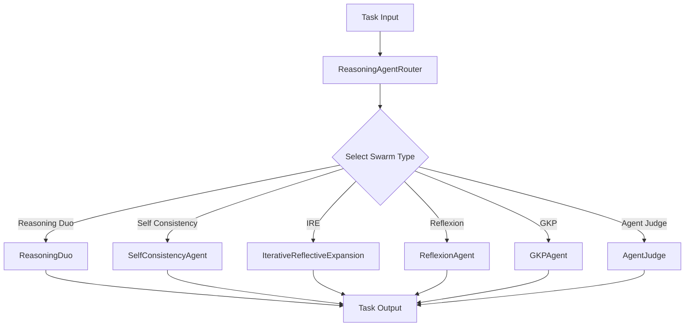

The `ReasoningAgentRouter` enables dynamic selection and execution of different reasoning strategies based on task requirements. It provides a flexible interface to work with multiple reasoning approaches.

The router builds a fresh agent of the selected type on every `run()` call, so no state carries over from one call to the next.

<Note>
[Tree of Thoughts](/agents/tree-of-thoughts) is not a router type. Use `TreeOfThoughts` directly.
</Note>

## Architecture



## Parameters

| Parameter | Type | Default | Description |
|-----------|------|---------|-------------|
| `agent_name` | `str` | `"reasoning_agent"` | Name identifier for the agent |
| `description` | `str` | `"A reasoning agent..."` | Description of the agent's capabilities |
| `model_name` | `str` | `"gpt-5.4"` | The underlying language model to use |
| `system_prompt` | `str` | `"You are a helpful..."` | System prompt for the agent |
| `max_loops` | `int` | `1` | Maximum number of reasoning loops |
| `swarm_type` | `agent_types` | `"reasoning-duo"` | Type of reasoning swarm to use |
| `num_samples` | `int` | `1` | Number of samples for self-consistency, and the number of iterations for IRE |
| `output_type` | `OutputType` | `"dict-all-except-first"` | Format of the output, for the types that format their output (see below) |
| `num_knowledge_items` | `int` | `6` | Number of knowledge items for GKP agent |
| `memory_capacity` | `int` | `6` | Long-term memory capacity for `ReflexionAgent` |
| `eval` | `bool` | `False` | Enable evaluation mode for self-consistency |
| `random_models_on` | `bool` | `False` | Enable random model selection for diversity |
| `majority_voting_prompt` | `Optional[str]` | `None` | Passed to `SelfConsistencyAgent`, which stores it but does not use it in aggregation |
| `reasoning_model_name` | `Optional[str]` | `"gpt-4o"` | Model for the reasoning agent in ReasoningDuo |

The constructor raises `ReasoningAgentInitializationError` when `max_loops` is `0`, or when `model_name` or `swarm_type` is empty. An unknown `swarm_type` is not caught until `run()`, which then raises `ReasoningAgentExecutorError`. Both exceptions live in `swarms.agents.reasoning_agent_router`.

## Available Agent Types

`swarm_type` accepts the values in the `agent_types` literal, which you can import with `from swarms import agent_types`. Each type receives only some of the router's parameters:

| `swarm_type` | Builds | Router parameters it receives | Return value of `run()` |
|--------------|--------|-------------------------------|-------------------------|
| `"reasoning-duo"`, `"reasoning-agent"` | [`ReasoningDuo`](/agents/reasoning-duo) | `agent_name`, `description`, `system_prompt`, `output_type`, `reasoning_model_name`, `max_loops` | Formatted by `output_type` |
| `"self-consistency"`, `"consistency-agent"` | [`SelfConsistencyAgent`](/agents/self-consistency-agent) | `agent_name`, `description`, `model_name`, `system_prompt`, `max_loops`, `num_samples`, `output_type`, `eval`, `random_models_on`, `majority_voting_prompt` | Formatted by `output_type` |
| `"ire"`, `"ire-agent"` | [`IterativeReflectiveExpansion`](/agents/iterative-agent) | `agent_name`, `description`, `model_name`, `system_prompt`, `output_type`, and `num_samples` as its `max_loops` | Formatted by `output_type` |
| `"ReflexionAgent"` | [`ReflexionAgent`](/agents/reflexion-agent) | `agent_name`, `system_prompt`, `model_name`, `max_loops`, `memory_capacity` | A one-item `list` holding the best response |
| `"GKPAgent"` | [`GKPAgent`](/agents/gkp-agent) | `agent_name`, `model_name`, `num_knowledge_items` | The final answer as a `str` |
| `"AgentJudge"` | [`AgentJudge`](/agents/agent-judge) | `agent_name`, `model_name`, `system_prompt`, `max_loops` | The judge's conversation as a `str` |

`output_type` has no effect on `"ReflexionAgent"`, `"GKPAgent"` or `"AgentJudge"`.

<Warning>
With `"reasoning-duo"`, `model_name` reaches neither internal agent. The reasoning agent runs on `reasoning_model_name`, and the main agent always runs on `ReasoningDuo`'s default model, `"gpt-5.4"`. To choose the main agent's model, create [`ReasoningDuo`](/agents/reasoning-duo) directly and set `model_names`.
</Warning>

<Note>
With `"ire"`, the router passes `num_samples`, not `max_loops`, as the number of IRE iterations. With `"AgentJudge"`, the router's `system_prompt` replaces the judge's built-in evaluation prompt, so pass a judging prompt.
</Note>

## Methods

| Method | Description |
|--------|-------------|
| `select_swarm()` | Builds and returns a new agent of the selected type |
| `run(task, *args, **kwargs)` | Builds the selected agent and runs it on `task`. Extra arguments are forwarded to that agent's `run()`. Any error is re-raised as `ReasoningAgentExecutorError` |
| `batched_run(tasks, *args, **kwargs)` | Calls `run` on each task in order and returns a list of results. Extra arguments are not forwarded |

## Examples

### Basic Usage

```python
from swarms import ReasoningAgentRouter

router = ReasoningAgentRouter(
    agent_name="reasoning-agent",
    model_name="claude-sonnet-4-6",
    swarm_type="self-consistency",
    num_samples=3,
)

result = router.run("What is the best approach to solve this problem?")
```

### Self-Consistency with Evaluation

```python
from swarms import ReasoningAgentRouter

router = ReasoningAgentRouter(
    swarm_type="self-consistency",
    num_samples=5,
    model_name="claude-sonnet-4-6",
    eval=True,
)

# answer is forwarded to SelfConsistencyAgent.run; None means no sample contained it
result = router.run("What is 2 + 2?", answer="4")
```

### ReasoningDuo with Image Support

```python
from swarms import ReasoningAgentRouter

router = ReasoningAgentRouter(
    swarm_type="reasoning-duo",
    reasoning_model_name="claude-sonnet-4-6",
    max_loops=2,
)

result = router.run(
    "Analyze this image and explain the patterns you see",
    img="data_visualization.png",
)
```

The reasoning agent runs on `reasoning_model_name` and the main agent on `"gpt-5.4"`. Both must accept images.

### GKP Agent

```python
from swarms import ReasoningAgentRouter

router = ReasoningAgentRouter(
    swarm_type="GKPAgent",
    model_name="claude-sonnet-4-6",
    num_knowledge_items=6
)

result = router.run("What are the implications of quantum entanglement?")
```

### Reflexion Agent

```python
from swarms import ReasoningAgentRouter

router = ReasoningAgentRouter(
    swarm_type="ReflexionAgent",
    max_loops=3,
    model_name="claude-sonnet-4-6"
)

results = router.run("Explain quantum computing to a beginner.")
print(results[0])
```

### IRE Agent

```python
from swarms import ReasoningAgentRouter

router = ReasoningAgentRouter(
    swarm_type="ire",
    model_name="claude-sonnet-4-6",
    num_samples=2,
)

result = router.run("Design a caching strategy for a read-heavy API.")
```

`num_samples=2` runs two IRE iterations.

## Choosing the Right Type

| Scenario | Recommended Type | Why |
|----------|-----------------|-----|
| Tasks requiring high reliability | `self-consistency` | Multiple validation paths, consensus building |
| Complex tasks needing analysis + action | `reasoning-duo` | Separates reasoning from execution |
| Problems requiring iterative refinement | `ire` | Designed for progressive improvement |
| Tasks requiring introspection | `ReflexionAgent` | Self-reflection and learning from experience |
| Knowledge-intensive tasks | `GKPAgent` | Generates knowledge before reasoning |
| Quality control | `AgentJudge` | Specialized evaluation capabilities |
| Problems with checkable steps, where one wrong step ruins the answer | None: use [`TreeOfThoughts`](/agents/tree-of-thoughts) directly | Scores and prunes partial steps, and backtracks from dead ends |

## Best Practices

1. **Swarm Type Selection**: Match the reasoning strategy to your task requirements
2. **Performance**: Adjust `max_loops` and `num_samples` based on task complexity
3. **Self-Consistency**: Use 3-5 samples for most tasks, 7+ for critical decisions
4. **Multi-modal**: Use vision-capable models when processing images
5. **ReasoningDuo**: Set the reasoning agent's model with `reasoning_model_name`. To choose the main agent's model too, use `ReasoningDuo` directly
