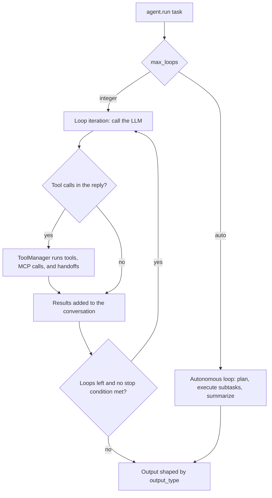

## Overview

The `Agent` class is the core component of the Swarms framework, connecting LLMs with tools, memory, and autonomous capabilities. It provides a production-ready interface for building agents that can reason, call tools, handle multimodal inputs, and execute complex tasks.



| Feature                                 | Description                                                                                      |
|------------------------------------------|--------------------------------------------------------------------------------------------------|
| **Conversational Loop**                  | Enables back-and-forth interaction with the model.                                               |
| **Stoppable Conversation**               | Supports custom stopping conditions for the conversation.                                        |
| **Retry Mechanism**                      | Retries failed LLM calls, then raises `AgentLLMError` so fallback models can take over.          |
| **Tool Integration**                     | Supports the integration of various tools for enhanced capabilities.                             |
| **Persistent Memory**                    | Optional `MEMORY.md` that survives restarts, with automatic context compression.                 |
| **Interactive Mode**                     | Allows real-time communication with the agent.                                                   |
| **Asynchronous and Concurrent Execution**| Supports efficient parallelization of tasks.                                                     |
| **Planning and Reasoning**               | Implements planning functionality for enhanced decision-making.                                  |
| **Autonomous Planning and Execution**    | When `max_loops="auto"`, automatically creates plans, executes subtasks, and generates summaries. Includes built-in tools for file operations, user communication, and workspace management. |
| **Agent Handoffs and Task Delegation**   | Lets the model delegate tasks to other agents through a `handoff_task` tool.                     |
| **Token Accounting**                     | `agent.usage` sums provider-reported tokens; `agent.input_tokens` sizes the next request.        |

## Import

```python
from swarms import Agent
```

## Key Features

- **Tool Integration**: Native support for function calling and tool execution
- **Persistent Memory**: Optional `MEMORY.md` across restarts, plus automatic context compression
- **Autonomous Loops**: Dynamic execution with configurable stopping conditions
- **Multi-modal Support**: Process text, images, and other media
- **MCP Support**: Integration with Model Context Protocol servers
- **Agent Handoffs**: Delegate tasks to specialized agents
- **Streaming**: Real-time token streaming with callbacks
- **Fallback Models**: Automatic failover to backup models
- **State Management**: Autosave and state persistence
- **Token Usage**: Provider-reported token totals on `agent.usage`
- **Telemetry**: Optional OpenTelemetry tracing of every run

## Architecture

`Agent` delegates its larger subsystems to dedicated collaborator objects, each built during `__init__` and reachable as an attribute.

| Attribute | Class | Owns |
|---|---|---|
| `agent.llm_manager` | [`LLMManager`](/api/llm-manager) | Model selection, LiteLLM construction, invocation, streaming, fallback rotation |
| `agent.tool_manager` | [`ToolManager`](/api/tool-manager) | Tool setup, dynamic tool loading, tool-call parsing and execution, retries, MCP execution, handoffs |
| `agent.mcp_manager` | [`MCPManager`](/api/mcp-manager) | MCP server connections, tool discovery, tool-call routing |
| `agent.skills` | [`SkillsManager`](/api/skills-manager) | Agent Skills discovery and prompt rendering |
| `agent.marketplace` | [`AgentMarketplaceHandler`](/api/agent-marketplace-handler) | Fetching and publishing marketplace prompts |
| `agent.autonomous_loop` | `AutonomousAgentLoop` | The plan, execute, and summarize loop behind `max_loops="auto"` (see [Autonomous mode](/agents/autonomous-mode)) |

Model, fallback, and skills helpers on the agent are thin wrappers over their manager, so both call styles work:

```python
agent = Agent(agent_name="Analyst", model_name="gpt-5.4-mini")

# These are equivalent
agent.get_current_model()
agent.llm_manager.get_current_model()
```

Tool handling has no agent-level wrappers. Apart from `add_tool`, `add_tools`, `remove_tool`, `remove_tools`, and the `mcp_enabled` property, you reach it through `agent.tool_manager` (for example `agent.tool_manager.execute_tools(...)`). See [Tool handling](#tool-handling).

Each collaborator is independently documented. Reach for it directly when you want the behavior without going through the agent.

## Initialization

<Note>
  `Agent.__init__` also accepts `*args` and `**kwargs` and ignores them. A misspelled keyword argument is silently dropped rather than rejected, so check names against this list.
</Note>

<ParamField path="id" type="Optional[str]" default="None">
  Unique identifier for the agent instance. When omitted the agent generates one via `generate_id("agent")`, of the form `agent-` followed by 32 hex characters (`secrets.token_hex(16)`) — not a UUID.
</ParamField>

<ParamField path="agent_name" type="str" default="swarm-worker-01">
  The name of the agent, used for identification and logging. Omit it and the
  agent defaults to the literal `"swarm-worker-01"` — every agent that does
  not set a name shares this same value.

  <Note>
    Because the default is a shared literal rather than a generated value,
    anything keyed on `agent_name` collides across unnamed agents: concurrent
    result dictionaries keep one entry for the whole group, and `MEMORY.md`
    folders are shared. Pass an explicit name whenever agents run
    concurrently or need memory to be stable across restarts.
  </Note>
</ParamField>

<ParamField path="agent_description" type="str" default="An autonomous agent that can perform tasks and learn from experience powered by Swarms">
  A description of the agent's purpose and capabilities. Shown to orchestrators when routing tasks.
</ParamField>

<ParamField path="system_prompt" type="Optional[str]" default="None">
  The system prompt that defines the agent's behavior and personality. When `None`, the agent uses the framework's general-purpose `AGENT_SYSTEM_PROMPT_3`, rendered with the current time by `build_agent_system_prompt()`, rather than an empty prompt. Some options append to it during construction: `max_loops="auto"` (autonomous-mode instructions), `reasoning_prompt_on`, `react_on`, `handoffs`, and `dynamic_tools`.
</ParamField>

<ParamField path="llm" type="Optional[Any]" default="None">
  The language model instance to use. If `None`, a LiteLLM client is built from the agent's settings. A caller-supplied LiteLLM client with an unset `usage_hook` is wired into `agent.usage` too.
</ParamField>

<ParamField path="model_name" type="str" default="gpt-5.4">
  The LiteLLM-compatible model identifier (e.g. `"gpt-5.4"`, `"claude-sonnet-4-6"`, `"groq/llama-3.3-70b-versatile"`). Ignored when `fallback_models` is set, since that list names the primary model.
</ParamField>

<ParamField path="llm_args" type="dict" default="None">
  Extra keyword arguments forwarded to the underlying LiteLLM client.
</ParamField>

<ParamField path="prompt_caching" type="bool" default="False">
  Enable provider-side prompt caching. When `True`, ephemeral `cache_control` breakpoints are added to the stable prefix of each request (system prompt, tools, and the last message) so it is cached and re-billed at a large discount. Applies to the Anthropic model family (Claude on Anthropic / Bedrock / Vertex); providers that cache automatically (e.g. OpenAI) are left untouched. See the [Prompt Caching guide](/agents/prompt-caching).
</ParamField>

<ParamField path="cache_config" type="dict" default="None">
  Fine-grained prompt-caching options; only consulted when `prompt_caching=True`. All keys optional:
  - `ttl` (`str`): `"5m"` (default) or `"1h"` for Anthropic's extended cache (2x write cost, survives longer gaps; the required beta header is attached automatically).
  - `cache_system_prompt` (`bool`, default `True`): cache the system prefix.
  - `cache_messages` (`bool`, default `True`): cache through the last message (incremental multi-turn caching).
  - `cache_tools` (`bool`, default `True`): cache the tool-definitions block.
  - `override` (`bool`, default `None`): force `cache_control` injection on/off regardless of the detected provider (e.g. opt Gemini/Vertex in, or a custom alias out). `None` auto-detects (Anthropic only).
  - `prompt_cache_key` (`str`): OpenAI-only routing hint for higher cache hit rates.
  - `prompt_cache_retention` (`str`): OpenAI-only cache TTL — `"in_memory"` or `"24h"`.
</ParamField>

<ParamField path="llm_base_url" type="str" default="None">
  Base URL for OpenAI-compatible providers (Ollama, LM Studio, vLLM, etc.).
</ParamField>

<ParamField path="llm_api_key" type="str" default="None">
  Override API key for the LLM provider. Falls back to environment variables when unset.
</ParamField>

<ParamField path="fallback_model_name" type="str" default="None">
  Single fallback model used when the primary model fails. Only consulted when `fallback_models` is not set.
</ParamField>

<ParamField path="max_loops" type="Optional[Union[int, str]]" default="1">
  Number of loop iterations per run. Pass `"auto"` for [autonomous mode](#autonomous-mode): plan, execute subtasks, then summarize. Anything other than a positive integer or `"auto"` raises `AgentInitializationError`.
</ParamField>

<ParamField path="tools" type="List[Callable]" default="None">
  Callable functions the agent can use as tools. Their schemas and the tool executor are built during construction, so pass every tool here rather than adding them later.
</ParamField>

<ParamField path="temperature" type="Optional[float]" default="None">
  Sampling temperature. Left unset, it is omitted from requests and the provider's default applies. Some models (for example recent Claude models) reject an explicit temperature with HTTP 400, which is why the default is `None`.
</ParamField>

<ParamField path="max_tokens" type="Optional[int]" default="None">
  Maximum number of tokens in the LLM response. A positive value you pass is kept and forwarded to the LLM. Leave it as `None` (or pass `0`/a negative number) and the agent resolves the model's own maximum output-token limit, falling back to `16000` when that lookup fails.
</ParamField>

<ParamField path="context_length" type="int" default="None">
  Effective context window in tokens. When `context_compression=True`, the agent compresses memory once usage crosses 90% of this limit. Leave as `None` to derive the window from the model's input limit, falling back to `16000` when that lookup fails.
</ParamField>

<ParamField path="top_p" type="float" default="None">
  Nucleus-sampling parameter. Left unset, it is not sent. Stripped automatically for Anthropic models when extended thinking is enabled.
</ParamField>

<ParamField path="dynamic_context_window" type="bool" default="True">
  When `True`, the text rendering of the conversation history (`short_memory.return_history_as_string()`) drops its oldest characters until it fits within `context_length` tokens. It affects every path that sends or measures the history as text, such as `transforms`, `plan()`, and `input_tokens`.
</ParamField>

<ParamField path="context_compression" type="bool" default="True">
  When `True`, the agent runs a `ContextCompressor` that summarises the conversation history once it crosses 90% of `context_length`, so long sessions never hit the context wall. It checks at the start of every loop iteration, and between subtask iterations in autonomous mode.
</ParamField>

<ParamField path="persistent_memory" type="bool" default="False">
  When `True`, read/write `MEMORY.md` at `{WORKSPACE_DIR}/agents/{agent_name}/MEMORY.md` so agent state survives process restarts. Off by default: opt in explicitly.

  <Warning>
    The preload is a `System` message, and `run` skips `System` messages when it builds the request, so the model may never see it. Do not assume the agent "remembers" earlier runs. See [Agent memory](/agents/agent-memory).
  </Warning>
</ParamField>

<ParamField path="messages" type="Optional[List[Dict[str, Any]]]" default="None">
  Prior conversation turns in chat format, e.g. `[{"role": "user", "content": "..."}]`. They seed `short_memory` at construction and are re-sent as context on every run. Keys other than `role` and `content` (`name`, `tool_calls`, `tool_call_id`) are kept as message metadata. To supply turns for a single call instead, pass `messages` to [`run`](#run).
</ParamField>

<ParamField path="transforms" type="Union[TransformConfig, dict]" default="None">
  Message transforms (`TransformConfig` from `swarms.structs.transforms`, or an equivalent dict) applied to the history before each LLM call. When set, the agent sends a flattened text rendering of the transformed history instead of its structured message transcript.
</ParamField>

<ParamField path="streaming_on" type="bool" default="False">
  Stream tokens as they are generated. By default tokens render in a Rich streaming panel. With a `streaming_callback`, each token string goes to the callback instead. With `print_on=False` and no callback, the stream is collected silently.
</ParamField>

<ParamField path="stream" type="bool" default="False">
  Detailed token-by-token streaming. Every token is printed with its metadata (`ResponseStream {...}`), and the per-token metadata dict (token, model, finish reason, citations, usage, and so on) is passed to `streaming_callback`. Takes precedence over `streaming_on`.
</ParamField>

<ParamField path="streaming_callback" type="Optional[Callable[[str], None]]" default="None">
  Receives tokens as they stream. It is only called when the agent streams: with `streaming_on=True` it gets each token string, and with `stream=True` it gets each per-token metadata dict. With neither flag set it is never called. `run_stream` and `arun_stream` turn `streaming_on` on for you.
</ParamField>

<ParamField path="interactive" type="bool" default="False">
  REPL-style mode. After each loop iteration the agent prompts you for input, and your reply is sent to the model as the next user turn. Each reply uses one loop, so set `max_loops` above 1 to hold a conversation. Typing `custom_exit_command`, or pressing Ctrl+C or Ctrl+D, ends the session. When `run()` gets no task, an interactive agent prompts for one instead of raising `ValueError`. Setting it turns `reasoning_prompt_on` off. It has no effect with `max_loops="auto"`, which always runs the autonomous loop.
</ParamField>

<ParamField path="verbose" type="bool" default="False">
  Enable verbose logging for debugging.
</ParamField>

<ParamField path="print_on" type="bool" default="True">
  When `False`, suppress the agent's printed output (Rich panels, thinking panel, etc.). Token streams via `arun_stream` / `streaming_callback` are unaffected.
</ParamField>

<ParamField path="output_type" type="OutputType" default="str-all-except-first">
  How the run's result is formatted. See [Output Types](#output-types) for all 15 accepted values.
</ParamField>

<ParamField path="autosave" type="bool" default="False">
  Save agent state during execution: `save()` at the start and end of each run and on errors, plus a `config.json` snapshot in the agent workspace at each loop step. See [Autosave](#autosave).
</ParamField>

<ParamField path="dashboard" type="bool" default="False">
  Display agent dashboard on initialization
</ParamField>

<ParamField path="long_term_memory" type="Optional[Union[Callable, Any]]" default="None">
  A store that is written out with agent state. The agent never queries it — only `.save(path)` is ever called on it, so this does not provide RAG. For retrieval, expose the lookup as a tool instead.
</ParamField>

<ParamField path="fallback_models" type="List[str]" default="None">
  Ordered list of models to use. When set, it replaces `model_name`: the first entry is the primary model and the rest are tried in order if a run fails. See [Fallback model helpers](#fallback-model-helpers).
</ParamField>

<ParamField path="retry_attempts" type="Optional[int]" default="3">
  Attempts per loop iteration for the LLM call. When every attempt fails, the run raises `AgentLLMError`, and `run()` then moves on to the next fallback model if one is configured. See [Error Handling](#error-handling).
</ParamField>

<ParamField path="stopping_token" type="str" default="None">
  Stored on the agent, but the run loop never checks it. To end a run early, use `stopping_condition` or `stopping_func`.
</ParamField>

<ParamField path="stopping_condition" type="Callable[[str], bool]" default="None">
  Called with the response after each loop iteration (integer `max_loops`). Returning `True` ends the run.
</ParamField>

<ParamField path="stopping_func" type="Callable" default="None">
  Alternative stopping function, checked after `stopping_condition` in the same way.
</ParamField>

<ParamField path="dynamic_temperature_enabled" type="bool" default="False">
  At the start of each loop iteration, set the LLM client's temperature to a random value between 0.0 and 1.0.
</ParamField>

<ParamField path="dynamic_loops" type="bool" default="False">
  Sets `max_loops` to `"auto"` during construction, so `run()` enters the autonomous loop. Unlike passing `max_loops="auto"` directly, the autonomous-mode instructions are not appended to the system prompt.
</ParamField>

<ParamField path="loop_interval" type="int" default="0">
  Seconds to wait between consecutive loop iterations.
</ParamField>

<ParamField path="custom_exit_command" type="str" default="exit">
  Text the user can type in interactive mode to exit the loop. Compared case-insensitively.
</ParamField>

<ParamField path="preset_stopping_token" type="bool" default="False">
  Sets `agent.stopping_token` to `"<DONE>"`. The check is `is not None`, so this also happens with the default `False`. Nothing in the run loop reads `stopping_token`.
</ParamField>

<ParamField path="auto_generate_prompt" type="bool" default="False">
  At the start of each run (integer `max_loops`), set `agent.system_prompt` to a prompt the LLM generates from `agent_name`, `agent_description`, and the current `system_prompt`, and record it in the conversation. The task is used only when all three are empty. The LLM client keeps the system prompt it was built with until you call `agent.llm_handling()`.
</ParamField>

<ParamField path="user_name" type="str" default="Human">
  Name of the user in conversation history
</ParamField>

<ParamField path="saved_state_path" type="str" default="Auto-generated">
  Path that `save()` writes to when called with no argument. When unset, falls back to an auto-generated `{api_key}_state.json` filename inside the agent workspace.
</ParamField>

<ParamField path="sop" type="str" default="None">
  Standard operating procedure. Added to the conversation as a user message during construction.
</ParamField>

<ParamField path="sop_list" type="List[str]" default="None">
  List of standard operating procedures, joined with newlines into `sop` and added to the conversation during construction.
</ParamField>

<ParamField path="rules" type="str" default="None">
  Rules that govern agent behavior, added to the conversation after the system prompt.
</ParamField>

<ParamField path="planning_prompt" type="str" default="None">
  Replaces the default planning instruction that `plan()` sends when `plan_enabled=True`.
</ParamField>

<ParamField path="plan_enabled" type="bool" default="False">
  Run [`plan(task)`](#plan) at the start of each run (integer `max_loops`). The plan is added to the conversation before the first loop.
</ParamField>

<ParamField path="multi_modal" type="Optional[bool]" default="None">
  When `True`, sets `sop` to the framework's multi-modal instruction prompt, which is added to the conversation during construction. Images are accepted through `run(img=..., imgs=...)` whether or not this is set.
</ParamField>

<ParamField path="tool_call_summary" type="bool" default="True">
  After callable tools run, make a separate LLM call that summarises their output and add the summary to the conversation. MCP tool results are always summarised this way.
</ParamField>

<ParamField path="tool_retry_attempts" type="int" default="3">
  Total attempts for a batch of callable tool calls. Each attempt runs the batch once. If every attempt fails, `AgentToolExecutionError` is raised inside the loop, the failure is recorded in the conversation, and the run continues so the model can react to it. Also used as the MCP retry count.
</ParamField>

<ParamField path="show_tool_execution_output" type="bool" default="True">
  Display tool inputs/outputs in the agent's printed output.
</ParamField>

<ParamField path="tools_list_dictionary" type="Optional[List[Dict[str, Any]]]" default="None">
  OpenAI function-calling schemas sent to the model as-is. Calls to a schema with no matching callable in `tools` are not executed: the tool call itself (name plus arguments) becomes the response, which is how you get structured output.
</ParamField>

<ParamField path="tool_schema" type="Union[BaseModel, Dict[str, Any]]" default="None">
  A Pydantic model (or dict) converted to a function-calling schema and added to the conversation as a message during construction. It is not registered as a callable tool.
</ParamField>

<ParamField path="output_cleaner" type="Callable" default="None">
  Stored on the agent, but the run loop does not apply it. `agent.output_cleaner_op(response)` runs it and records the cleaned text in the conversation under the role `"Output Cleaner"`.
</ParamField>

<ParamField path="list_base_models" type="List[BaseModel]" default="None">
  Pydantic models meant to be added to the conversation as function-calling schemas.

  <Warning>
    Passing a non-empty `list_base_models` currently raises `TypeError` during construction. `ToolManager.handle_tool_schema_ops` calls `BaseTool.multi_base_models_to_dict` without the list. Convert each model with `BaseTool().base_model_to_dict(Model)` (from `swarms.tools.base_tool`) and pass the results in `tools_list_dictionary` instead.
  </Warning>
</ParamField>

<ParamField path="mcp_url" type="Optional[Union[str, MCPConnection, Dict]]" default="None">
  A single MCP server. Pass a URL string for an unauthenticated server, or an `MCPConnection`/dict to configure auth, transport, headers and timeouts.
</ParamField>

<ParamField path="mcp_urls" type="Optional[List[Union[str, MCPConnection, Dict]]]" default="None">
  Several MCP servers. Each entry may be a URL string, an `MCPConnection`, or a dict. Tools from every server are merged and each tool call is routed back to the server that owns it.
</ParamField>

<ParamField path="mcp_config" type="Optional[Union[MCPConnection, Dict]]" default="None">
  A single MCP server given as a connection object (or the equivalent dict).
</ParamField>

<ParamField path="mcp_configs" type="Optional[List[Union[MCPConnection, Dict]]]" default="None">
  Several MCP servers given as connection objects (or dicts).
</ParamField>

<ParamField path="mcp_api_key" type="Optional[str]" default="None">
  API key applied to every MCP server that does not define its own. Sent as `Authorization: Bearer <key>` by default; override the header or prefix per-server with `MCPConnection(api_key_header=..., api_key_prefix=...)`. Supports `"env:MY_VAR"` / `"${MY_VAR}"` indirection so secrets stay out of code.
</ParamField>

<ParamField path="mcp_authorization_token" type="Optional[str]" default="None">
  Bearer token applied to every MCP server that does not define its own. Equivalent to `mcp_api_key` with the default header and prefix.
</ParamField>

<ParamField path="mcp_oauth" type="Optional[Union[MCPOAuthConfig, Dict]]" default="None">
  OAuth 2.1 settings applied to every MCP server without its own. Supports the interactive authorization-code flow (PKCE plus dynamic client registration, tokens cached on disk), the headless `client_credentials` grant, and pre-issued access tokens.
</ParamField>

<ParamField path="mcp_headers" type="Optional[Dict[str, str]]" default="None">
  Extra headers merged into every MCP request.
</ParamField>

<ParamField path="mcp_transport" type="Optional[Literal['streamable_http', 'sse', 'stdio', 'auto']]" default="None">
  Force a transport for every MCP server, overriding each connection's own setting. With `None`, each connection uses its own `transport`, which defaults to `streamable_http`, so a URL is not auto-detected. Pass `"auto"` to detect from the URL: HTTP URLs become `streamable_http` (or `sse` when the URL looks like an SSE endpoint), and a value with no scheme runs as a stdio command.
</ParamField>

<ParamField path="mcp_timeout" type="Optional[int]" default="None">
  HTTP request timeout in seconds for every MCP server. Falls back to the per-connection default of 30. It does not bound how long a tool call may run. Set `tool_timeout` (default 120 seconds) on the `MCPConnection` for that.
</ParamField>

<ParamField path="handoffs" type="Union[Sequence[Callable], Any]" default="None">
  Agents this agent can delegate to, as a list or a `{name: agent}` dict. The agent gets a `handoff_task` tool and a prompt listing each target's name and description. See [Agent Handoffs and Task Delegation](#agent-handoffs-and-task-delegation).
</ParamField>

<ParamField path="capabilities" type="List[str]" default="None">
  Free-form capability labels. Sent along with `tags` when the agent is published to the marketplace. The agent itself does not read them.
</ParamField>

<ParamField path="role" type="agent_roles" default="worker">
  The agent's role within a swarm (e.g. `"worker"`, `"director"`). One of the `agent_roles` literal values in `swarms.structs.agent_roles`.
</ParamField>

<ParamField path="tags" type="List[str]" default="None">
  Tags used to categorise the agent. Sent to the marketplace on publish.
</ParamField>

<ParamField path="use_cases" type="List[Dict[str, Any]]" default="None">
  Intended use cases, each a dict with `title` and `description`. Required when publishing to the marketplace.
</ParamField>

<ParamField path="mode" type="Literal['interactive', 'fast', 'standard']" default="standard">
  Only `"fast"` changes behavior: it sets `print_on=False` and `verbose=False` at the end of construction. `"interactive"` and `"standard"` change nothing. For a REPL, set `interactive=True`.
</ParamField>

<ParamField path="marketplace_prompt_id" type="str" default="None">
  UUID of a Swarms marketplace prompt. It is fetched during construction and appended to the system prompt, and it fills in `agent_name` / `agent_description` when they are still at their defaults. Requires `SWARMS_API_KEY`.
</ParamField>

<ParamField path="publish_to_marketplace" type="bool" default="False">
  When `True`, publish this agent's prompt and metadata to the Swarms marketplace during construction. Requires `use_cases` (otherwise `AgentInitializationError`) and `SWARMS_API_KEY`.
</ParamField>

<ParamField path="skills_dir" type="Optional[Union[str, List[str]]]" default="None">
  Directory of Agent Skills (Anthropic `SKILL.md` format), or a list of directories. Directories are read in order, and when two hold a skill with the same name the later one wins and a warning is logged. The constructor annotation says `str`, but a list is passed straight through to `SkillsManager`.

  On each run the agent selects the skills whose descriptions match the task and sends them with every LLM call: as a system message when the call carries a message list, otherwise in front of the task text. `system_prompt` is not modified. See [Skills helpers](#skills-helpers).
</ParamField>

<ParamField path="selected_tools" type="Optional[Union[str, List[str]]]" default="all">
  Tools to enable for the autonomous looper when `max_loops="auto"`. Use `"all"`, or a list of tool names — the list filters the **entire** loop tool set, control-flow tools included, so include `create_plan` and `complete_task` unless you intend to remove them. `get_autonomous_loop_tool_names()` from `swarms.structs.autonomous_loop_utils` returns every valid name.
</ParamField>

<ParamField path="think_tool" type="bool" default="False">
  Give the autonomous looper (`max_loops="auto"`) a `think` tool for an explicit reasoning turn. Off by default: it costs a full round-trip to produce reasoning most models can emit inline alongside their actions. When `False` the system prompt is adjusted to match, so the model is never told to call a tool it does not have.
</ParamField>

<ParamField path="max_planning_attempts" type="int" default="5">
  Autonomous mode only. How many times to ask the model for a plan before the run fails.
</ParamField>

<ParamField path="max_subtask_iterations" type="int" default="100">
  Autonomous mode only. Ceiling on passes of the execution phase across the whole run. Each pass picks the next runnable subtask and works it for up to `max_subtask_loops` iterations. When the ceiling is reached, execution stops and the agent moves to the final summary.
</ParamField>

<ParamField path="max_subtask_loops" type="int" default="20">
  Autonomous mode only. Ceiling on iterations spent inside any one subtask. A subtask that exhausts it is marked failed and the loop moves on.

  <Note>
    All three budgets must be at least 1. A smaller value raises `ValueError` during construction.
  </Note>
</ParamField>

<ParamField path="dynamic_tools" type="bool" default="False">
  Defer tool schemas behind a `tool_search` tool instead of sending them all on every request. Off by default; opt in with `True`. See [Dynamic Tool Loading](#dynamic-tool-loading) below.
</ParamField>

<ParamField path="react_on" type="bool" default="False">
  Append the framework's ReAct prompt to the system prompt.
</ParamField>

<ParamField path="reasoning_prompt_on" type="bool" default="True">
  When `max_loops` is 2 or more (or `"auto"`), append the framework's reasoning preamble to the system prompt and, for integer `max_loops`, add a `Current Internal Reasoning Loop: i/N` message at each iteration. `interactive=True` turns it off.
</ParamField>

<ParamField path="reasoning_enabled" type="bool" default="False">
  Enable reasoning mode on the LLM client. Combined with `thinking_tokens` it sends an extended-thinking request. On models LiteLLM lists as reasoning-capable, the temperature is set to 1.
</ParamField>

<ParamField path="reasoning_effort" type="Optional[Literal['none', 'minimal', 'low', 'medium', 'high', 'xhigh', 'ultra', 'max', 'None']]" default="None">
  Effort level for reasoning models: `"minimal"`, `"low"`, `"medium"`, `"high"`, `"xhigh"`, `"ultra"`, `"max"`, or `"none"`. The annotation is the `ReasoningEffort` literal in `swarms.utils.get_reasoning_efforts`.

  Left unset, the parameter is not sent to the provider at all.

  <Warning>
    Do not combine `reasoning_effort` with `tools` on OpenAI reasoning models such as `gpt-5.4-mini`. `/v1/chat/completions` rejects the pair with `BadRequestError: Function tools with reasoning_effort are not supported`. This is why the default is `None`: it previously defaulted to `"medium"`, which shipped on every request and made `Agent(model_name="gpt-5.4-mini", tools=[...])` fail out of the box.
  </Warning>
</ParamField>

<ParamField path="thinking_tokens" type="int" default="1024">
  Extended-thinking budget. Sent as `thinking={"type": "enabled", "budget_tokens": thinking_tokens}` when `reasoning_enabled=True`. For Anthropic models, `max_tokens` is raised above the budget when needed.
</ParamField>

<ParamField path="safety_prompt_on" type="bool" default="False">
  Append the framework's safety prompt to the system message stored in the agent's conversation.
</ParamField>

<ParamField path="random_models_on" type="bool" default="False">
  Once, during construction, set `model_name` to a random pick from the built-in model list in `swarms.structs.ma_utils`. The LLM client is built just before this, so calls keep using the original model until the client is rebuilt.
</ParamField>

<ParamField path="workspace_dir" type="str">
  Not a constructor argument — any value passed here is ignored. The workspace root is read from the `WORKSPACE_DIR` environment variable; set it explicitly (e.g. via a `.env` file — `.env.example` uses `agent_workspace`). When it is unset, `agent.workspace_dir` resolves to `None` and an error is logged; the workspace manager behind `agent.workspace` then falls back to `{cwd}/agent_workspace` the first time it needs a directory. Each agent gets its own subdirectory at `{workspace}/agents/{agent-name}-{id12}/`, where `id12` is the last 12 characters of `agent.id`. Read the resolved path from `agent.workspace.dir`.
</ParamField>

<ParamField path="load_state_path" type="str" default="None">
  Default path for [`load()`](#load) when it is called without an argument. Nothing is loaded during construction.
</ParamField>

## Methods

### run

Execute the agent's main loop for a given task. With `max_loops="auto"` it runs the [autonomous loop](#autonomous-mode); otherwise it runs up to `max_loops` iterations.

```python
def run(
    task: Optional[Union[str, Any]] = None,
    img: Optional[str] = None,
    imgs: Optional[List[str]] = None,
    correct_answer: Optional[str] = None,
    streaming_callback: Optional[Callable[[str], None]] = None,
    n: int = 1,
    messages: Optional[List[Dict[str, Any]]] = None,
    *args,
    **kwargs
) -> Any
```

<ParamField path="task" type="Union[str, Any]">
  The task or prompt for the agent to process. Non-string values are formatted to text. An empty task raises `ValueError` unless `interactive=True`, in which case the agent prompts for one.
</ParamField>

<ParamField path="img" type="str">
  Optional image for vision-enabled models: a file path, URL, data URI, or raw base64 string.
</ParamField>

<ParamField path="imgs" type="List[str]">
  Optional list of images, sent together in one request. Ignored when `max_loops="auto"`.

  <Warning>
    In this release `img` and `imgs` reach the model only when the agent was built with `transforms`. On the default path the agent sends its structured message transcript, and the LiteLLM wrapper does not attach images to a prebuilt message list, so the image is silently dropped. The autonomous loop has the same limitation. Until this is fixed, build vision agents with `transforms=TransformConfig()` (from `swarms.structs.transforms`), which sends the history as text plus the image.
  </Warning>
</ParamField>

<ParamField path="correct_answer" type="str">
  Accepted for compatibility but not used to check the output. It is only forwarded to fallback-model runs.
</ParamField>

<ParamField path="streaming_callback" type="Callable[[str], None]">
  Overrides the agent's `streaming_callback` for this call. It is only called when the agent streams (`streaming_on=True` or `stream=True`).
</ParamField>

<ParamField path="n" type="int" default="1">
  Number of samples. When `n > 1`, the task runs `n` times, each sample receives every input (`img`, `imgs`, `streaming_callback`, `messages`), and `run` returns a list of `n` results. The samples share the agent's conversation. Ignored when `max_loops="auto"`.
</ParamField>

<ParamField path="messages" type="List[Dict[str, Any]]">
  Prior conversation as typed chat turns. When given, these replace the transcript
  the agent would otherwise derive from its own memory, and `task` is appended as
  the new user turn. The turns are also recorded in `short_memory`, and with
  `max_loops="auto"` the autonomous loop's transcript starts from them.
  Multi-agent structures use this to hand an agent the shared
  room with roles intact — the agent's own turns as `assistant`, everyone else's
  as labelled `user` turns — instead of one flattened string.

  ```python
  agent.run(
      task="What did the analyst conclude?",
      messages=[
          {"role": "user", "content": "Summarise the Q3 numbers."},
          {"role": "assistant", "content": "Revenue rose 12%."},
          {"role": "user", "content": "Analyst: margins are the risk."},
      ],
  )
  ```
</ParamField>

<ResponseField name="return" type="Any">
  Agent output formatted according to output_type configuration
</ResponseField>

**Return types based on input:**

| Scenario              | Return Type     | Description                                             |
|-----------------------|-----------------|---------------------------------------------------------|
| Single task           | Per `output_type` | The conversation shaped by `output_type` (a string by default) |
| `n > 1`               | `List[Any]`     | One result per sample, each shaped by `output_type`     |
| `max_loops="auto"`    | Per `output_type` | Shaped by `output_type` on every path, including when the model ends with `complete_task` |
| Streaming             | Per `output_type` | The complete result after streaming completes          |

**Raises:** `ValueError` for an empty task outside interactive mode. `AgentLLMError`, chained from the last provider error, once every retry and every fallback model has failed. See [Error Handling](#error-handling).

**Examples:**

```python
# Basic usage
response = agent.run("Generate a report on financial performance.")

# Single image processing
response = agent.run(
    task="Analyze this image and describe what you see",
    img="path/to/image.jpg"
)

# Multiple image processing
response = agent.run(
    task="Analyze these images and identify common patterns",
    imgs=["image1.jpg", "image2.png", "image3.jpeg"]
)

# Three independent samples
samples = agent.run("Suggest a name for a coffee shop.", n=3)
```

To receive tokens as they arrive, build the agent with `streaming_on=True` and pass a callback:

```python
from swarms import Agent

def streaming_callback(token: str):
    print(token, end="", flush=True)

agent = Agent(agent_name="Storyteller", model_name="gpt-5.4", streaming_on=True)

response = agent.run(
    task="Tell me a long story about space exploration",
    streaming_callback=streaming_callback,
)
```

### __call__

Alternative syntax for running the agent (calls `run` internally).

```python
def __call__(
    task: Optional[str] = None,
    img: Optional[str] = None,
    *args,
    **kwargs
) -> Any
```

### arun

Async version of `run`. It runs `run` in a worker thread with `asyncio.to_thread`, passing positional arguments in `run`'s order.

```python
async def arun(
    task: Optional[str] = None,
    img: Optional[str] = None,
    *args,
    **kwargs,
) -> Any
```

### run_batched

Run multiple tasks **sequentially**, one after another, and collect the results. For concurrent execution use `run_concurrent_tasks` instead.

```python
def run_batched(
    tasks: List[str],
    imgs: List[str] = None,
    *args,
    **kwargs,
) -> List[Any]
```

<ParamField path="tasks" type="List[str]">
  List of tasks to run, in order
</ParamField>

<ParamField path="imgs" type="List[str]" default="None">
  One image per task, paired by position. Omit to run the tasks without images. A length mismatch raises `ValueError` rather than silently dropping the extras.
</ParamField>

<ResponseField name="return" type="List[Any]">
  List of results from each task execution, in the same order as the input tasks
</ResponseField>

```python
tasks = [
    "Analyze the financial data for Q1",
    "Generate a summary report for stakeholders",
    "Create recommendations for Q2 planning"
]

batch_results = agent.run_batched(tasks)

for i, (task, result) in enumerate(zip(tasks, batch_results)):
    print(f"Task {i+1}: {task}")
    print(f"Result: {result}\n")
```

### run_stream

Run the agent and yield response tokens one-by-one as a sync generator. It calls `run` in a background daemon thread with `streaming_on` switched on for the duration, so every `max_loops` value takes its normal path, and `max_loops="auto"` enters the autonomous loop. Tokens are forwarded to the caller the moment the LLM emits them. Extra `kwargs` go to `run`, and an exception raised by the run is re-raised after the stream ends.

```python
def run_stream(
    task: str,
    img: Optional[str] = None,
    **kwargs,
) -> Iterator[str]
```

Tool-call results are fed back into the loop automatically — tokens from each subsequent LLM turn (synthesis turn, autonomous summary phase, etc.) are streamed through as well.

```python
for token in agent.run_stream("Analyse NVDA"):
    print(token, end="", flush=True)
```

### arun_stream

Async generator version of `run_stream`. `run` executes in a background thread while tokens are forwarded through an `asyncio.Queue`, so the caller's event loop is never blocked.

```python
async def arun_stream(
    task: str,
    img: Optional[str] = None,
    **kwargs,
) -> AsyncIterator[str]
```

```python
import asyncio

async def main():
    async for token in agent.arun_stream("Analyse NVDA"):
        print(token, end="", flush=True)

asyncio.run(main())
```

<Note>
  Both `run_stream` and `arun_stream` work for any `max_loops` value (1, integer &gt; 1 with tools, or `"auto"`). They stream tokens through every internal loop, including tool-call turns, synthesis turns after a tool returns, and the autonomous plan/execute/summary cycle.
</Note>

### run_concurrent_tasks

Run a batch of tasks concurrently on a call-scoped thread pool (`os.cpu_count()` workers). Results come back in the order the tasks were given. A failure is logged and re-raised.

```python
def run_concurrent_tasks(
    tasks: List[str],
    *args,
    **kwargs,
) -> List[Any]
```

<Note>
  Every task runs on the same agent and shares its `short_memory`. For isolated runs, give each task its own agent.
</Note>

### bulk_run

Generate responses for multiple input sets, one after another. Each input is a dict of kwargs forwarded to `run`. If any run raises, the error is logged and `bulk_run` returns `None`.

```python
def bulk_run(
    inputs: List[Dict[str, Any]],
) -> List[str]
```

### save

Save the agent's current state to a JSON file via `SafeStateManager`, writing atomically through a temporary file. A relative `file_path` is resolved inside the agent workspace (`agent.workspace.dir`); an absolute path is used as-is. `.json` is appended when missing. With no argument, `saved_state_path` is used. `long_term_memory`, when set, is saved alongside as `{name}_memory.json`.

```python
def save(
    file_path: str = None
) -> None
```

### load

Load agent state from a saved JSON file via `SafeStateManager`. If `file_path` is omitted, falls back to `load_state_path`, then `f"{saved_state_path}.json"`. Unlike `save`, a relative path is resolved against the current working directory, not the agent workspace, so pass an absolute path to load what `save` wrote.

```python
def load(
    file_path: str = None
) -> None
```

### save_to_yaml

Save the agent to a YAML file.

```python
def save_to_yaml(
    file_path: str
) -> None
```

### to_dict

Convert every agent attribute (except `llm`) to a dictionary. Callables become `{"name", "doc"}` dicts, and values that cannot be serialized become `"<Non-serializable: TypeName>"`.

```python
def to_dict() -> Dict[str, Any]
```

### to_json

Convert agent configuration to JSON string. Extra arguments go to `json.dumps`.

```python
def to_json(
    indent: int = 4,
    *args,
    **kwargs
) -> str
```

### to_yaml

Convert agent configuration to YAML string. Extra arguments go to `yaml.dump`.

```python
def to_yaml(
    indent: int = 4,
    *args,
    **kwargs
) -> str
```

### to_toml

Convert agent configuration to TOML string. Extra arguments go to `toml.dumps`.

```python
def to_toml(*args, **kwargs) -> str
```

### model_dump_json / model_dump_yaml

Save the agent configuration to `{agent_name}.json` or `{agent_name}.yaml` in the agent workspace, and return a message naming the path.

```python
def model_dump_json() -> str
def model_dump_yaml() -> str
```

### add_tool / add_tools / remove_tool / remove_tools

Append callables to `agent.tools`, or remove them from it.

```python
def add_tool(tool: Callable) -> None
def add_tools(tools: List[Callable]) -> None
def remove_tool(tool: Callable) -> None
def remove_tools(tools: List[Callable]) -> None
```

<Warning>
  These only edit the `agent.tools` list. The schemas sent to the model and the executor that runs tool calls (`agent.tool_struct`) are built during construction and are not rebuilt, so the model cannot call a tool added afterwards. `agent.tools` is `None` on an agent built without tools, so `add_tool` raises `AttributeError` there. Pass every tool to the constructor instead.
</Warning>

### add_memory

Append a message to the agent's short-term memory under the agent's own name.

```python
def add_memory(message: str) -> None
```

### talk_to

Run `task` on this agent, then send the output to `agent` as `"From {agent_name}: Message: {output}"` and return that agent's response.

```python
def talk_to(
    agent: Any,
    task: str,
    img: Optional[str] = None,
    *args,
    **kwargs
) -> Any
```

### talk_to_multiple_agents

Run `talk_to` against several agents concurrently on a call-scoped thread pool.

```python
def talk_to_multiple_agents(
    agents: List[Union[Any, Callable]],
    task: str,
    *args,
    **kwargs
) -> Any
```

Returns one entry per agent, in the order the agents were given. An agent whose conversation raised contributes `None`.

### receive_message / send_agent_message

`receive_message` wraps an incoming message from another agent in a short preamble and runs it through the agent's normal `run()` loop, returning the agent's response. `send_agent_message` prefixes a message with `To: {agent_name}:` and runs that through `run()`, returning the result.

```python
def receive_message(agent_name: str, task: str, *args, **kwargs) -> Any
def send_agent_message(agent_name: str, message: str, *args, **kwargs) -> str
```

<Note>
  Task delegation via `handoffs` happens automatically inside `run()` — the LLM calls an internal handoff tool when it decides to delegate. There is no separate public `handle_handoffs()` method to call directly.
</Note>

### reset

Drop the agent's short-term memory by setting `agent.short_memory = None`. Nothing is re-initialized in its place.

```python
def reset() -> None
```

<Warning>
  After `reset()` the agent cannot run again until `short_memory` is replaced with a fresh `Conversation`. Construct a new agent instead unless you intend to rebuild it yourself.
</Warning>

### plan

Ask the LLM for a step-by-step plan for `task` (using `planning_prompt` when set) and add the plan to the conversation. Nothing is executed and nothing is returned.

```python
def plan(task: str, *args, **kwargs) -> None
```

### print_dashboard

Display the agent's configuration dashboard.

```python
def print_dashboard() -> None
```

### showcase_config

Display the agent's configuration in a formatted table.

```python
def showcase_config() -> None
```

### update_system_prompt / update_max_loops / update_loop_interval

In-place setters for runtime reconfiguration. Each one only sets the attribute.

```python
def update_system_prompt(system_prompt: str) -> None
def update_max_loops(max_loops: Union[int, str]) -> None
def update_loop_interval(loop_interval: int) -> None
```

<Note>
  The LLM client copies the system prompt when it is built, so after `update_system_prompt` call `agent.llm_handling()` to rebuild the client before the next run. Switching to `max_loops="auto"` with `update_max_loops` does not append the autonomous-mode instructions that the constructor adds.
</Note>

### Tool handling

Tool setup, parsing, execution, retries, MCP execution, handoffs, and dynamic tool loading live on [`agent.tool_manager`](/api/tool-manager), a `ToolManager` (from `swarms.agents.tool_manager`) built once per agent. The agent no longer has wrapper methods for them.

| Moved to `agent.tool_manager` | What it does |
|---|---|
| `execute_tools(response, loop_count)` | Run the callable tool calls in a response and record their output |
| `tool_execution_retry(response, loop_count)` | Run `execute_tools` up to `tool_retry_attempts` times, then raise `AgentToolExecutionError` |
| `mcp_tool_handling(response, current_loop=0)` | Run the MCP tool calls in a response and record a summary |
| `parse_llm_output(response)` | Normalize a model response to text or a list of tool-call dicts |
| `handle_tool_schema_ops()` | Add `tool_schema` / `list_base_models` schemas to the conversation |
| `temp_llm_instance_for_tool_summary()` | Build the tool-free client used for tool-output summaries |
| `setup_dynamic_tools(always_loaded=None)` | Rebuild the [`DynamicToolLoader`](/api/dynamic-tool-loader) behind `tool_search`; returns it and stores it on `agent.tool_loader` |
| `defer_tool_schemas(schemas)` | Add pre-built schemas to the deferred catalog |
| `defer_mcp_tools()` | Move MCP tool schemas into the deferred catalog, fetching them once |
| `add_mcp_tools_to_memory()` | Fetch tool schemas from the configured MCP servers through [`MCPManager`](/api/mcp-manager) |

`get_all_selected_tools()` was removed. Use `get_autonomous_loop_tool_names()` from `swarms.structs.autonomous_loop_utils` to list every autonomous-loop tool name:

```python
from swarms.structs.autonomous_loop_utils import get_autonomous_loop_tool_names

print(get_autonomous_loop_tool_names())
```

### Properties and attributes

| Property | Type | Value |
|---|---|---|
| `agent.usage` | `dict` | Provider-reported token usage summed over every LLM call the agent's clients have made. See [Token usage](#token-usage). |
| `agent.input_tokens` | `int` | Estimated tokens the next request would carry. See [Token usage](#token-usage). |
| `agent.workspace` | `WorkspaceManager` | The agent's workspace manager, created on first access and rooted at `{workspace}/agents/{name}-{id12}`. Read the resolved path from `agent.workspace.dir`. |
| `agent.mcp_enabled` | `bool` | Whether at least one MCP server is configured. Backed by [`MCPManager`](/api/mcp-manager), which normalizes `mcp_url`, `mcp_urls`, `mcp_config`, and `mcp_configs` into one list of connections. |
| `agent.skills_dir` | `Optional[Union[str, List[str]]]` | Reads and writes through to `agent.skills`. Setting it discards cached skills. |
| `agent.skills_metadata` | `List[Dict[str, str]]` | Metadata for the skills loaded so far. |

Notable attributes, all set during construction:

| Attribute | Value |
|---|---|
| `agent.llm` | The LiteLLM client (or the `llm` you passed). Rebuild it with `agent.llm_handling()`. |
| `agent.short_memory` | The agent's `Conversation`. |
| `agent.llm_manager`, `agent.tool_manager`, `agent.mcp_manager`, `agent.skills`, `agent.marketplace`, `agent.autonomous_loop` | The collaborators listed under [Architecture](#architecture). |
| `agent.tool_struct` | The `BaseTool` executor built from `tools`. |
| `agent.tool_loader` | The `DynamicToolLoader` when `dynamic_tools` applies, else `None`. |

### get_llm_parameters

Returns the parameters of the language model as a string (`str(vars(self.llm))`).

```python
def get_llm_parameters() -> str
```

### Fallback model helpers

Methods backing the `fallback_models` / `fallback_model_name` feature. All delegate to [`LLMManager`](/api/llm-manager).

```python
def get_available_models() -> List[str]
def get_current_model() -> str
def switch_to_next_model() -> bool
def reset_model_index() -> None
def is_fallback_available() -> bool
```

### Skills helpers

Agent Skills loading, delegating to [`SkillsManager`](/api/skills-manager).

```python
def handle_skills(task: Optional[str] = None) -> None
def load_skills_metadata(skills_dir: str = None) -> List[Dict[str, str]]
def load_full_skill(skill_name: str) -> Optional[str]
```

| Method | Behaviour |
|---|---|
| `handle_skills(task)` | Select the skills for `task` (every skill when `task` is `None`) and store the rendered section. `call_llm` then sends it with every request; `system_prompt` is left unchanged. `run` calls this automatically when `skills_dir` is set. |
| `load_skills_metadata(skills_dir)` | Tier 1 loading: return `name`, `description`, `path`, and `content` for every `SKILL.md` in the directory or list of directories (defaults to `skills_dir`). |
| `load_full_skill(skill_name)` | Tier 2 loading: return the body of one already-loaded skill, or `None`. |

`agent.skills_dir` and `agent.skills_metadata` are properties that read and write through to the manager.

### Marketplace helpers

Marketplace integration, delegating to [`AgentMarketplaceHandler`](/api/agent-marketplace-handler).

```python
def handle_publish_to_marketplace() -> Dict[str, Any]   # requires use_cases
```

Setting `marketplace_prompt_id` loads a prompt during construction; setting `publish_to_marketplace=True` publishes during construction.

### Complete Methods Reference

Every public method on `Agent`. Tool-handling methods now live on `agent.tool_manager`; see [Tool handling](#tool-handling).

| Method | Description | Usage Example |
|--------|-------------|---------------|
| `run(task, img, imgs, correct_answer, streaming_callback, n, messages)` | Run the agent loop, or the autonomous loop when `max_loops="auto"` | `agent.run("Generate a report")` |
| `__call__(task, img)` | Alternative way to call `run` | `agent("Generate a report")` |
| `arun(task, img)` | Async version of `run` | `await agent.arun("Task")` |
| `run_stream(task, img)` | Sync streaming generator over `run` | `for t in agent.run_stream("Task"): ...` |
| `arun_stream(task, img)` | Async streaming generator over `run` | `async for t in agent.arun_stream("Task"): ...` |
| `run_batched(tasks, imgs)` | Run multiple tasks sequentially | `agent.run_batched(["Task 1", "Task 2"])` |
| `run_concurrent_tasks(tasks)` | Run multiple tasks concurrently | `agent.run_concurrent_tasks(["T1", "T2"])` |
| `bulk_run(inputs)` | Run `run(**input)` for each input dict, in order | `agent.bulk_run([{"task": "T1"}])` |
| `call_llm(task, img, imgs, current_loop, streaming_callback)` | Make one LLM call through `LLMManager`, with the selected skills attached | `agent.call_llm("Generate text")` |
| `plan(task)` | Add an LLM-generated plan to the conversation | `agent.plan("Analyze trends")` |
| `add_memory(message)` | Add a message to short-term memory | `agent.add_memory("Important info")` |
| `reset()` | Drop short-term memory (leaves the agent unusable until rebuilt) | `agent.reset()` |
| `save(file_path)` | Save agent state to JSON | `agent.save("state.json")` |
| `load(file_path)` | Load agent state from JSON | `agent.load("/abs/path/state.json")` |
| `save_to_yaml(file_path)` | Save `to_dict()` to a YAML file | `agent.save_to_yaml("config.yaml")` |
| `to_dict()` | Convert to dictionary | `agent.to_dict()` |
| `to_json(indent)` | Convert to JSON string | `agent.to_json()` |
| `to_yaml(indent)` | Convert to YAML string | `agent.to_yaml()` |
| `to_toml()` | Convert to TOML string | `agent.to_toml()` |
| `model_dump_json()` | Save config to `{agent_name}.json` in the workspace | `agent.model_dump_json()` |
| `model_dump_yaml()` | Save config to `{agent_name}.yaml` in the workspace | `agent.model_dump_yaml()` |
| `get_saveable_state()` | The values `save` would write | `agent.get_saveable_state()` |
| `get_preserved_instances()` | The class instances `load` keeps in place | `agent.get_preserved_instances()` |
| `add_tool(tool)` | Append to `agent.tools` (not re-registered with the model) | `agent.add_tool(my_tool)` |
| `add_tools(tools)` | Extend `agent.tools` (not re-registered with the model) | `agent.add_tools([t1, t2])` |
| `remove_tool(tool)` | Remove from `agent.tools` | `agent.remove_tool(my_tool)` |
| `remove_tools(tools)` | Remove several from `agent.tools` | `agent.remove_tools([t1, t2])` |
| `talk_to(agent, task)` | Run a task, then send the output to another agent | `agent.talk_to(other, "Collaborate")` |
| `talk_to_multiple_agents(agents, task)` | `talk_to` several agents concurrently | `agent.talk_to_multiple_agents([a1], "Task")` |
| `receive_message(agent_name, task)` | Run a message received from another agent through `run()` | `agent.receive_message("User", "Hello")` |
| `send_agent_message(agent_name, message)` | Run `"To: {agent_name}: {message}"` through `run()` | `agent.send_agent_message("AgentX", "Done")` |
| `update_system_prompt(system_prompt)` | Set `system_prompt` (rebuild with `llm_handling()`) | `agent.update_system_prompt("New prompt")` |
| `update_max_loops(max_loops)` | Set `max_loops` | `agent.update_max_loops(5)` |
| `update_loop_interval(loop_interval)` | Set `loop_interval` | `agent.update_loop_interval(2)` |
| `llm_handling()` | Rebuild the LLM client from the current configuration; returns it and stores it on `agent.llm` | `agent.llm_handling()` |
| `get_llm_parameters()` | Get LLM parameters (as a string) | `agent.get_llm_parameters()` |
| `get_available_models()` | List primary + fallback model names | `agent.get_available_models()` |
| `get_current_model()` | Get the model currently in use | `agent.get_current_model()` |
| `switch_to_next_model()` | Switch to the next fallback model | `agent.switch_to_next_model()` |
| `reset_model_index()` | Reset back to the primary model | `agent.reset_model_index()` |
| `is_fallback_available()` | Whether more than one model is configured | `agent.is_fallback_available()` |
| `check_model_supports_utilities(img)` | Log an error for each capability the model lacks (vision, function calling, parallel calls) | `agent.check_model_supports_utilities()` |
| `dynamic_temperature()` | Set the LLM client's temperature to a random value in 0.0 to 1.0 | `agent.dynamic_temperature()` |
| `check_available_tokens()` | `context_length` minus the tokens in the history | `agent.check_available_tokens()` |
| `handle_skills(task)` | Select skills for a task; sent with every LLM call | `agent.handle_skills("Build a DCF")` |
| `load_skills_metadata(skills_dir)` | Load Agent Skills metadata | `agent.load_skills_metadata("./skills")` |
| `load_full_skill(skill_name)` | Load complete skill content | `agent.load_full_skill("my-skill")` |
| `handle_publish_to_marketplace()` | Publish to the Swarms marketplace | `agent.handle_publish_to_marketplace()` |
| `handle_sop_ops()` | Add `sop` / `sop_list` to the conversation | `agent.handle_sop_ops()` |
| `check_if_no_prompt_then_autogenerate(task)` | Generate a system prompt when `auto_generate_prompt=True` | `agent.check_if_no_prompt_then_autogenerate("Task")` |
| `output_cleaner_op(response)` | Apply `output_cleaner` and record the result; returns `None` | `agent.output_cleaner_op(response)` |
| `list_output_types()` | Return the `OutputType` literal type | `typing.get_args(agent.list_output_types())` |
| `pretty_print(response, loop_count)` | Print a response panel when `print_on` is set | `agent.pretty_print("Done", 1)` |
| `print_dashboard()` | Display dashboard | `agent.print_dashboard()` |
| `showcase_config()` | Display config table | `agent.showcase_config()` |
| `stream_response(response, delay)` | Sleep `delay` seconds per word of `response`; prints nothing | `agent.stream_response("Response", 0.001)` |
| `setup_config()` | Apply `dynamic_loops`, `multi_modal`, and `preset_stopping_token` (called by `__init__`) | `agent.setup_config()` |
| `short_memory_init()` | Build the `Conversation` used as `short_memory` (called by `__init__`) | `agent.short_memory_init()` |
| `reliability_check()` | Validate configuration; raises `AgentInitializationError` (called by `__init__`) | `agent.reliability_check()` |

## Advanced Capabilities

### Tool Integration

The `Agent` class allows seamless integration of external tools by accepting a list of Python functions via the `tools` parameter. Each tool function must include type annotations and a docstring. The agent automatically converts these functions into an OpenAI-compatible function calling schema.

| Requirement         | Description                                                      |
|---------------------|------------------------------------------------------------------|
| Function            | The tool must be a Python function.                              |
| With types          | The function must have type annotations for its parameters.      |
| With doc strings    | The function must include a docstring describing its behavior.   |
| Must return a string| The function must return a string value.                         |

```python
from swarms import Agent
import subprocess

def terminal(code: str):
    """
    Run code in the terminal.

    Args:
        code (str): The code to run in the terminal.

    Returns:
        str: The output of the code.
    """
    out = subprocess.run(code, shell=True, capture_output=True, text=True).stdout
    return str(out)

agent = Agent(
    agent_name="Terminal-Agent",
    model_name="claude-sonnet-4-6",
    tools=[terminal],
    system_prompt="You are an agent that can execute terminal commands.",
)

response = agent.run("List the contents of the current directory")
print(response)
```

You can also provide tool schemas in OpenAI function-calling dictionary format via `tools_list_dictionary`:

```python
from swarms import Agent
from swarms.prompts.finance_agent_sys_prompt import FINANCIAL_AGENT_SYS_PROMPT
from swarms.utils.str_to_dict import str_to_dict

tools = [
    {
        "type": "function",
        "function": {
            "name": "get_stock_price",
            "description": "Retrieve the current stock price for a specified company.",
            "parameters": {
                "type": "object",
                "properties": {
                    "ticker": {
                        "type": "string",
                        "description": "The stock ticker symbol, e.g. AAPL for Apple Inc.",
                    },
                    "include_history": {
                        "type": "boolean",
                        "description": "Whether to include historical price data.",
                    },
                    "time": {
                        "type": "string",
                        "format": "date-time",
                        "description": "Time for which stock data is requested, in ISO 8601 format.",
                    },
                },
                "required": ["ticker", "include_history", "time"],
            },
        },
    }
]

agent = Agent(
    agent_name="Financial-Analysis-Agent",
    agent_description="Personal finance advisor agent",
    system_prompt=FINANCIAL_AGENT_SYS_PROMPT,
    max_loops=1,
    tools_list_dictionary=tools,
)

out = agent.run("What is the current stock price for Apple Inc. (AAPL)?")
print(out)
print(str_to_dict(out))
```

### Dynamic Tool Loading

`dynamic_tools` is off by default (`False`): every tool schema is sent on every request. Opt in with `dynamic_tools=True` to change how tools reach the model.

Tool definitions are re-sent on every request, so a large tool set is paid for on every turn. When `dynamic_tools=True` **and** the agent has something to defer — that is, when `tools` are given, an MCP server is configured, or `max_loops="auto"` — the agent:

1. Appends a notice to the system prompt telling the model that most of its tools are **not** currently loaded.
2. Sends only a `tool_search` tool (plus anything marked always-loaded, such as the autonomous loop's control-flow tools `create_plan`, `think` (when `think_tool=True`), `subtask_done`, `complete_task`, and `respond_to_user`) instead of the full schema list.
3. Loads the schemas the model asks for through `tool_search`. **They become callable on the next turn, not the one that searched.**

An agent with no tools, no MCP server, and a fixed `max_loops` has nothing to defer, so nothing changes.

```python
from swarms import Agent

# Default: every schema is sent on every request
agent = Agent(
    agent_name="Toolsmith",
    model_name="gpt-5.4",
    tools=[search_web, read_file, write_file],
)

# Opt in: schemas are deferred behind tool_search
deferred_agent = Agent(
    agent_name="Deferred-Toolsmith",
    model_name="gpt-5.4",
    tools=[search_web, read_file, write_file],
    dynamic_tools=True,
)
```

<Warning>
  With `dynamic_tools=True` and `max_loops="auto"`, the loop's own file and bash tools are deferred too. A model that searches for a capability the catalog does not hold gets the closest lexical match rather than a miss, which can stall a subtask. This is why the default changed to `False`.
</Warning>

<Note>
  Deferral is a separate mechanism from `selected_tools`. `selected_tools` decides which autonomous-loop tools exist at all; `dynamic_tools` decides which of the existing schemas are sent up front.
</Note>

See the [Dynamic Tools guide](/agents/dynamic-tools) and the [DynamicToolLoader reference](/api/dynamic-tool-loader) for the search behaviour, pre-warming, and the always-loaded set.

### External Knowledge and Retrieval

Swarms bundles no vector database, and `Agent` performs no retrieval of its own. To give an agent access to an external knowledge base, expose the lookup as a **tool** — the agent then decides when to query it and the result enters the conversation like any other tool output.

```python
from swarms import Agent


def search_knowledge_base(query: str) -> str:
    """Search the company knowledge base for passages matching a query.

    Args:
        query: What to search for.

    Returns:
        The matching passages, as text.
    """
    # Call whatever store you already run - Chroma, Qdrant, Pinecone, Postgres.
    hits = my_vector_store.query(query, top_k=3)
    return "\n\n".join(h.text for h in hits)


agent = Agent(
    agent_name="Financial-Analysis-Agent",
    model_name="claude-sonnet-4-6",
    system_prompt="You answer using the company knowledge base.",
    tools=[search_knowledge_base],
    max_loops=3,
)

response = agent.run("What are the components of a startup's stock incentive equity plan?")
print(response)
```

<Warning>
`long_term_memory` is a constructor parameter, but the agent never queries it. The only method invoked on it is `.save(path)`, and only when agent state is written to disk. Passing a vector store here does **not** give the agent retrieval — use a tool, as above.
</Warning>

### Memory Persistence and Context Compression

The agent ships with two complementary memory controls that work together to manage what is remembered between runs and how the context window is managed during long sessions.

#### Persistent Memory

With `persistent_memory=True` the agent reads and writes a `MEMORY.md` file under `$WORKSPACE_DIR/agents/{agent_name}/MEMORY.md`. Every message is appended to this file, and the next agent constructed with the same name loads it back into `agent.short_memory` as a `System` message.

The default is `persistent_memory=False` — no on-disk state at all, so the agent starts from a blank slate every run. If you opt in, use the same `agent_name` each time, since the memory file is keyed on it.

<Warning>
  Loading the file does not guarantee the model reads it. `run` builds its request from the non-`System` turns (or, with `max_loops="auto"`, from the task and `messages`), and the preload is a `System` message. To give the model prior context, pass it in `system_prompt`, the task, or `messages`. See [Agent memory](/agents/agent-memory).
</Warning>

```python
from swarms import Agent

# Opt in: memory survives process restarts
agent = Agent(
    agent_name="Persistent-Agent",
    model_name="gpt-5.4",
    system_prompt="You are a helpful assistant.",
    persistent_memory=True,
)

agent.run("My name is Alice and I work in finance.")
# A later process reloads MEMORY.md, but the model may not see it (see the warning above).


# Default: stateless, no cross-session memory
stateless_agent = Agent(
    agent_name="Stateless-Agent",
    model_name="gpt-5.4",
    system_prompt="You are a helpful assistant.",
    # persistent_memory=False is the default
)

stateless_agent.run("Summarise the latest news.")
```

#### Context Compression

For long-running agents the conversation history can grow until it fills the context window. `context_compression=True` (the default) attaches a `ContextCompressor` that summarises the conversation history with the agent's own model whenever token usage crosses 90% of `context_length`, and replaces the history with that summary. The system prompt and rules are kept. With `persistent_memory=True`, `MEMORY.md` is wiped and re-seeded at the same time, so it stops growing.

The check runs at the start of every loop iteration. In autonomous mode it also runs between subtask iterations, and the loop rebuilds the request it sends around the summary, so the payload shrinks too. The summary call is not counted in `agent.usage`.

```python
from swarms import Agent

# Default: automatic summarisation when the window gets full
agent = Agent(
    agent_name="Long-Session-Agent",
    model_name="gpt-5.4",
    system_prompt="You are a research assistant.",
    max_loops=10,
    context_length=8192,
    # context_compression=True is the default
)

agent.run("Deep-dive analysis of transformer architecture papers.")
# Past ~7,372 tokens (90% of 8192) the history is summarised in place and the run continues.


# Disabled: keep every raw message intact
audit_agent = Agent(
    agent_name="Audit-Agent",
    model_name="gpt-5.4",
    system_prompt="You are a compliance auditor.",
    context_compression=False,
)
```

#### Combining Both Controls

```python
from swarms import Agent

# Persistent across runs + automatic context management (production default)
production_agent = Agent(
    agent_name="Production-Agent",
    model_name="gpt-5.4",
    system_prompt="You are a customer support assistant.",
    persistent_memory=True,
    context_compression=True,
    context_length=16000,
)

# Stateless + no compression (CI / unit-test friendly)
test_agent = Agent(
    agent_name="Test-Agent",
    model_name="gpt-5.4",
    system_prompt="You are a helpful assistant.",
    persistent_memory=False,
    context_compression=False,
    print_on=False,
)
```

### Token usage

Two read-only properties report token counts. See the [Token usage guide](/agents/token-usage) for walkthroughs.

| Property | What it measures |
|---|---|
| `agent.usage` | What the provider billed, summed over every LLM call the agent's clients have made: the main client and the tool-summary client. A caller-supplied `llm` is included when it exposes a `usage_hook`. Returns a copy with `input_tokens`, `output_tokens`, `cached_tokens` (the part of `input_tokens` served from the prompt cache), `reasoning_tokens` (the part of `output_tokens` spent thinking, 0 when the provider does not report it), and `total_tokens`. Streaming calls count once their stream has been consumed. |
| `agent.input_tokens` | How many tokens the next request would carry: the system prompt, the whole `short_memory` conversation, and the tool schemas, counted with the model's tokenizer. It is an estimate that runs slightly above the billed figure, because role labels are counted. |

```python
from swarms import Agent

agent = Agent(agent_name="Analyst", model_name="gpt-5.4", max_loops=1)

print(agent.input_tokens)
agent.run("Summarise the causes of the 2008 financial crisis.")
print(agent.usage)
```

The total lives on the agent rather than the client, so it survives the client being rebuilt by `tool_search` or a fallback-model switch.

### Agent Handoffs and Task Delegation

The `Agent` class supports task delegation through the `handoffs` parameter. Give it a list of specialized agents (or a `{name: agent}` dict) and the model can delegate work to them during a normal run.

**How Handoffs Work:**

1. **Setup**: During construction the agent registers a `handoff_task` tool and appends a prompt to its system prompt that lists each target's `agent_name` and `agent_description`.
2. **Delegation**: When the model decides to delegate, it calls `handoff_task` with one or more requests, each holding `agent_name`, `task`, and `reasoning`.
3. **Execution**: `agent.tool_manager` runs each named agent on its task. Several requests run in parallel.
4. **Results**: The combined responses are recorded in the conversation as a `Handoff Result`, where the next loop iteration (or the output) can use them.

| Feature                   | Description                                                                                   |
|---------------------------|-----------------------------------------------------------------------------------------------|
| **Model-driven routing**  | The model picks the target from the names and descriptions in its prompt                      |
| **Multiple Agent Support**| One `handoff_task` call can delegate to several agents at once                                |
| **Task Modification**     | The model writes the task text each target receives                                           |
| **Transparent Reasoning** | Each request carries a `reasoning` field, shown in the handoff panel                          |
| **Seamless Integration**  | Works with the existing `run()` method, including `max_loops="auto"`                          |

```python
from swarms import Agent

research_agent = Agent(
    agent_name="ResearchAgent",
    agent_description="Specializes in researching topics and providing detailed, factual information",
    model_name="gpt-5.4",
    max_loops=1,
    system_prompt="You are a research specialist.",
)

code_agent = Agent(
    agent_name="CodeExpertAgent",
    agent_description="Expert in writing, reviewing, and explaining code",
    model_name="gpt-5.4",
    max_loops=1,
    system_prompt="You are a coding expert.",
)

writing_agent = Agent(
    agent_name="WritingAgent",
    agent_description="Skilled in creative and technical writing",
    model_name="gpt-5.4",
    max_loops=1,
    system_prompt="You are a writing specialist.",
)

coordinator = Agent(
    agent_name="CoordinatorAgent",
    agent_description="Coordinates tasks and delegates to specialized agents",
    model_name="gpt-5.4",
    max_loops=1,
    handoffs=[research_agent, code_agent, writing_agent],
    system_prompt="You are a coordinator agent. Analyze tasks and delegate them to the most appropriate specialized agent.",
    output_type="all",
)

result = coordinator.run(task="Call all the agents and ask them how they are doing")
print(result)
```

### Autonomous Mode

When `max_loops="auto"` is set, `run()` hands the task to the autonomous loop (`agent.autonomous_loop`). The agent creates a structured plan with subtasks, executes them in dependency order, and generates a comprehensive summary. `run_stream` and `arun_stream` take the same path, and `interactive` has no effect here. See the [Autonomous mode guide](/agents/autonomous-mode) for a walkthrough.

Three constructor parameters bound the cost of a run:

| Parameter | Default | Bounds |
|---|---|---|
| `max_planning_attempts` | `5` | Requests for a plan before the run fails |
| `max_subtask_iterations` | `100` | Passes of the execution phase across the whole run; when reached, the loop skips to the summary |
| `max_subtask_loops` | `20` | Iterations inside one subtask; a subtask that runs out is marked failed |

When every subtask is done, the agent asks the model for a final summary through `complete_task`. If the model does not call it, the agent writes a summary itself from the subtask results. Either way the result is shaped by `output_type`, so `output_type="final"` returns that summary message rather than a different type depending on the path.

When `context_compression` is on, the `ContextCompressor` also runs between subtask iterations. After a compression, the request sent to the model is rebuilt from the summary plus the current subtask prompt.

#### Available Tools in Autonomous Mode

When `max_loops="auto"`, the agent has access to specialized tools:

| Tool | Description | Parameters |
|------|-------------|------------|
| `create_plan` | Create or revise the plan. Steps merge by `step_id`, and finished steps keep their results | `task_description` (str), `steps` (list of dicts) |
| `think` *(only when `think_tool=True`)* | Pause and reason about the current state before acting | `current_state` (str), `analysis` (str), `next_actions` (list), `confidence` (float) |
| `subtask_done` | Mark the current subtask complete and advance to the next | `task_id` (str), `summary` (str), `success` (bool) |
| `complete_task` | Mark the whole task complete and produce a final summary | `task_id` (str), `summary` (str), `success` (bool), `results` (str, optional), `lessons_learned` (str, optional) |
| `respond_to_user` | Send messages to the user | `message` (str), `message_type` (str) |
| `create_file` | Create a new file (fails if it already exists) | `file_path` (str), `content` (str) |
| `update_file` | Update an existing file | `file_path` (str), `content` (str), `mode` (str) |
| `read_file` | Read file contents | `file_path` (str) |
| `list_directory` | List files and directories | `directory_path` (str) |
| `delete_file` | Delete a file (directories are refused) | `file_path` (str) |
| `run_bash` | Execute a shell command in the process working directory | `command` (str), `timeout_seconds` (int, default 60) |
| `grep` | Search files for a pattern, returning matching lines. Preferred over `run_bash` for searches | `pattern` (str), `path` (str), `recursive` (bool), `case_insensitive` (bool), `include_line_numbers` (bool), `file_pattern` (str), `context_lines` (int) |
| `glob` | Find files by name pattern, recursively, newest first. Returns paths relative to the search root, ready for `read_file`. Preferred over `run_bash` `find` | `pattern` (str), `path` (str) |
| `create_sub_agent` | Create specialized sub-agents | `agents` (array of agent specs) |
| `assign_task` | Assign tasks to sub-agents | `assignments` (array), `wait_for_completion` (bool) |
| `check_sub_agent_status` | Inspect the async task status of a sub-agent via the sub-agent registry | `agent_name` (str) |
| `cancel_sub_agent_tasks` | Cancel a sub-agent's pending or running async tasks | `agent_name` (str) |

Your own `tools`, MCP tools, and the `handoff_task` tool (when `handoffs` is set) are available alongside these.

**Output caps.** `read_file`, `run_bash`, `grep`, and `glob` cap their output at a quarter of `context_length` tokens (4,096 tokens when there is no context length), counted with the model's tokenizer. A truncated result ends with a note giving how many tokens were kept out of the total, so the model can narrow its query.

**Bash guardrails.** `run_bash` refuses commands that match a blocklist of dangerous patterns (recursive deletes, piping into a shell, `sudo`, raw disk writes, and similar). Commands over 512 characters are refused too. When an over-length command carries a heredoc or redirect, the refusal tells the model to write the file with `create_file` or `update_file` instead.

<Warning>
  `selected_tools` filters this entire list, including the control-flow tools. A list that omits `create_plan` leaves the model unable to plan, and one that omits `subtask_done` leaves it unable to close a subtask, so each subtask ends only when it runs out of `max_subtask_loops`. Omitting `complete_task` is safe: the agent writes the final summary itself. Include the tools you need, or leave `selected_tools="all"`.
</Warning>

<Note>
  `think` is opt-in. It is stripped from the tool list unless the agent is constructed with `think_tool=True`, and the system prompt is adjusted to match so the model is never told to call a tool it lacks.
</Note>

The file tools, `grep`, and `glob` resolve relative paths against the agent's workspace directory (`$WORKSPACE_DIR/agents/{agent-name}-{id12}/`, reachable as `agent.workspace.dir`). `run_bash` runs in the process's current working directory, not the workspace.

```python
from swarms import Agent

agent = Agent(
    agent_name="Quantitative-Trading-Agent",
    agent_description="Advanced quantitative trading and algorithmic analysis agent",
    model_name="gpt-5.4",
    dynamic_temperature_enabled=True,
    max_loops="auto",
    dynamic_context_window=True,
    output_type="all",
)

out = agent.run(
    "Generate a comprehensive report on the top 5 publicly traded energy stocks. "
    "For each stock include company name, ticker, key financial metrics, and analysis. "
    "Only create 3 subtasks in your plan."
)
print(out)
```

#### Sub-Agent Delegation

The autonomous agent can create and manage sub-agents for parallel task execution. Each sub-agent gets the parent's model and the parent's `tools`. A sub-agent with tools runs with `max_loops=5` so it can call a tool and read the result; one without tools runs with `max_loops=1`. Sub-agents never run in autonomous mode, so they cannot recurse.

```python
from swarms import Agent

coordinator = Agent(
    agent_name="Research-Coordinator",
    agent_description="Coordinates complex research by delegating to specialized sub-agents",
    model_name="gpt-5.4",
    max_loops="auto",
    selected_tools="all",
)

task = """
Conduct comprehensive research on three emerging technology trends:
1. Artificial Intelligence in Healthcare
2. Quantum Computing Advances
3. Renewable Energy Innovations

For each topic, create a specialized sub-agent and assign research tasks.
"""

result = coordinator.run(task)
print(result)
```

| Benefit | Description |
|---------|-------------|
| **Parallel Processing** | Multiple tasks execute simultaneously for faster completion |
| **Specialization** | Each sub-agent can focus on a specific domain or capability |
| **Scalability** | Complex tasks can be broken into manageable pieces |
| **Reusability** | Sub-agents are cached and can handle multiple assignments |
| **Fault Tolerance** | One sub-agent failure doesn't stop others from completing |

### Batch Processing

Run a list of tasks one after another with `run_batched`. It is sequential, not concurrent — reach for `run_concurrent_tasks` when the tasks are independent and you want them in parallel:

```python
tasks = [
    "Analyze the financial data for Q1",
    "Generate a summary report for stakeholders",
    "Create recommendations for Q2 planning"
]

batch_results = agent.run_batched(tasks)

# One image per task, paired by position
tasks = ["Analyze this chart", "Identify patterns", "Summarize insights"]
images = ["chart1.png", "chart2.png", "chart3.png"]
batch_results = agent.run_batched(tasks, imgs=images)
```

Images are subject to the same limitation described under [`run`](#run).

## Examples

### Basic Usage

```python
from swarms import Agent

agent = Agent(
    agent_name="Financial-Analyst",
    model_name="claude-sonnet-4-6",
    max_loops=1,
    system_prompt="You are a financial analyst. Provide detailed, data-driven insights."
)

response = agent.run("Analyze the Q4 2024 revenue trends")
print(response)
```

### Minimal Configuration

```python
from swarms import Agent

agent = Agent(
    model_name="gpt-5.4",
    max_loops=1,
)

response = agent.run("What is the capital of France?")
print(response)
```

### Agent with Tools

```python
from swarms import Agent

def search_web(query: str) -> str:
    """Search the web for information."""
    return f"Search results for: {query}"

def calculate(expression: str) -> str:
    """Evaluate a mathematical expression."""
    return str(eval(expression))

agent = Agent(
    agent_name="Research-Agent",
    model_name="claude-sonnet-4-6",
    max_loops=5,
    tools=[search_web, calculate],
    system_prompt="You are a research assistant with web search and calculation abilities."
)

result = agent.run("Search for the population of Tokyo and calculate its growth rate")
```

### Multi-modal Agent

Both vision examples set `transforms`, because images are only attached on that path in this release. See the warning under [`run`](#run).

```python
from swarms import Agent
from swarms.structs.transforms import TransformConfig

agent = Agent(
    agent_name="Vision-Agent",
    model_name="claude-sonnet-4-6",
    multi_modal=True,
    max_loops=1,
    transforms=TransformConfig(),
)

response = agent.run(
    task="Describe what you see in this image and identify any objects",
    img="path/to/image.jpg"
)
```

### Multi-Image Processing

```python
from swarms import Agent
from swarms.structs.transforms import TransformConfig

image_agent = Agent(
    agent_name="Image-Analysis-Agent",
    model_name="gpt-5.4",
    system_prompt="You are an expert at analyzing images.",
    multi_modal=True,
    transforms=TransformConfig(),
)

images = ["product1.jpg", "product2.jpg", "product3.jpg"]
analysis = image_agent.run(
    task="Analyze these product images and identify design patterns",
    imgs=images
)
```

### Autonomous Agent with Auto Loops

The agent creates a plan with subtasks, executes each one with its tools, then writes a final summary.

```python
from swarms import Agent

agent = Agent(
    agent_name="Autonomous-Developer",
    model_name="claude-sonnet-4-6",
    max_loops="auto",
    max_subtask_loops=10,
    system_prompt="You are an autonomous software developer."
)

result = agent.run("Build a REST API for a todo application with authentication")
```

### Multiple Loops

```python
from swarms import Agent

agent = Agent(
    agent_name="Iterative-Reasoning-Agent",
    model_name="gpt-5.4",
    max_loops=3,
    reasoning_prompt_on=True,
    system_prompt="You are an agent that reasons through problems step by step.",
)

response = agent.run("Solve this complex problem step by step: [problem description]")
```

### Dynamic Loops

`dynamic_loops=True` switches `max_loops` to `"auto"` during construction, so the run goes through the autonomous loop.

```python
from swarms import Agent

agent = Agent(
    agent_name="Dynamic-Agent",
    model_name="gpt-5.4",
    dynamic_loops=True,
    system_prompt="You are an adaptive agent that plans its own work.",
)

response = agent.run("Analyze this complex scenario and provide insights")
```

### Agent with Streaming

With `streaming_on=True`, the callback receives each token as a string.

```python
from swarms import Agent

def on_token(token: str):
    print(token, end="", flush=True)

agent = Agent(
    agent_name="Streaming-Agent",
    model_name="claude-sonnet-4-6",
    streaming_on=True,
    streaming_callback=on_token,
    max_loops=1
)

response = agent.run("Write a creative story about space exploration")
```

### Token-by-Token Streaming

With `stream=True`, every token is printed with its metadata, and a `streaming_callback` would receive the per-token metadata dict instead of a string.

```python
from swarms import Agent

agent = Agent(
    model_name="gpt-5.4",
    max_loops=1,
    stream=True,
)

agent.run("Tell me a short story about a robot learning to paint.")
```

### Agent with Fallback Models

The first entry is the primary model; the others are tried in order if a run fails.

```python
from swarms import Agent

agent = Agent(
    agent_name="Reliable-Agent",
    fallback_models=["claude-sonnet-4-6", "gpt-5.4", "gpt-5.4-mini"],
    max_loops=1
)

response = agent.run("Generate a market analysis report")
```

### Agent with MCP Integration

A command string runs a local MCP server over stdio when the transport is `"stdio"`.

```python
from swarms import Agent

agent = Agent(
    agent_name="MCP-Agent",
    model_name="claude-sonnet-4-6",
    mcp_url="npx -y @modelcontextprotocol/server-filesystem /path/to/directory",
    mcp_transport="stdio",
    max_loops=3
)

result = agent.run("Read the contents of config.json and summarize the settings")
```

### Multiple MCP Connections

```python
from swarms import Agent

agent = Agent(
    model_name="gpt-5.4",
    mcp_urls=[
        "http://localhost:8000",
        "http://localhost:8001",
    ],
    max_loops=1,
)

response = agent.run("Use tools from both MCP servers")
```

### MCP with Connection Config

```python
from swarms import Agent, MCPConnection

mcp_config = MCPConnection(
    url="http://localhost:8000",
    name="my_mcp_server",
    tool_timeout=300,
)

# mcp_config and mcp_urls are merged; duplicate URLs are dropped
mcp_agent = Agent(
    agent_name="MCP-Enabled-Agent",
    model_name="gpt-5.4",
    system_prompt="You are an agent with access to external tools via MCP.",
    mcp_config=mcp_config,
    mcp_urls=["http://localhost:8001"],
    tool_call_summary=True,
)

response = mcp_agent.run("Use the available tools to analyze system status")
```

### Agent Handoffs

```python
from swarms import Agent

researcher = Agent(
    agent_name="Researcher",
    model_name="claude-sonnet-4-6",
    system_prompt="You are a research specialist."
)

writer = Agent(
    agent_name="Writer",
    model_name="claude-sonnet-4-6",
    system_prompt="You are a technical writer."
)

coordinator = Agent(
    agent_name="Coordinator",
    model_name="claude-sonnet-4-6",
    max_loops=5,
    handoffs=[researcher, writer],
    system_prompt="You coordinate tasks between research and writing teams."
)

result = coordinator.run("Create a comprehensive report on quantum computing")
```

### Interactive Mode

```python
from swarms import Agent

agent = Agent(
    agent_name="Interactive-Agent",
    model_name="claude-sonnet-4-6",
    interactive=True,
    max_loops=20,
    system_prompt="You are an interactive agent. Engage in a conversation with the user.",
)

agent.run("Let's start a conversation")
```

Each reply you type is sent to the model as the next turn and uses one loop, so `max_loops` caps the length of the session. Type `exit` (the default `custom_exit_command`) to stop early.

### Auto Generate Prompt

```python
from swarms import Agent

agent = Agent(
    agent_name="Financial-Analysis-Agent",
    system_prompt=None,
    model_name="gpt-5.4",
    max_loops=1,
    auto_generate_prompt=True,
)

agent.run("How can I establish a ROTH IRA to buy stocks and get a tax break?")
print(agent.system_prompt)
```

The generated prompt is stored on `agent.system_prompt`. Call `agent.llm_handling()` to send it as the system message on later runs.

### Reasoning-Enabled Models

```python
from swarms import Agent

# Extended thinking with an explicit budget
claude_agent = Agent(
    model_name="claude-sonnet-4-6",
    reasoning_enabled=True,
    thinking_tokens=8000,
    max_loops=1
)

# Effort level for an OpenAI reasoning model; leave it unset when the agent has tools
openai_agent = Agent(
    model_name="gpt-5.4",
    reasoning_effort="high",
    max_loops=1
)

response = claude_agent.run("Solve this complex mathematical problem step by step")
```

### Execution Modes

Only `mode="fast"` changes anything: it turns `print_on` and `verbose` off. For a REPL, use `interactive=True` instead of `mode="interactive"`.

```python
from swarms import Agent

# Same as print_on=False, verbose=False
fast_agent = Agent(
    model_name="gpt-5.4",
    mode="fast",
    max_loops=1
)

# Default behavior
standard_agent = Agent(
    model_name="gpt-5.4",
    mode="standard",
    max_loops=1
)
```

### Marketplace Prompt Loading

```python
from swarms import Agent

agent = Agent(
    model_name="claude-sonnet-4-6",
    marketplace_prompt_id="550e8400-e29b-41d4-a716-446655440000",
    max_loops=1
)

response = agent.run("Execute the marketplace prompt task")
```

### Publishing to Marketplace

```python
from swarms import Agent

agent = Agent(
    model_name="gpt-5.4",
    agent_name="Financial-Advisor",
    agent_description="Expert financial advisor agent",
    system_prompt="You are an expert financial advisor...",
    tags=["finance", "advisor"],
    capabilities=["financial_planning", "investment_advice"],
    use_cases=[
        {"title": "Retirement Planning", "description": "Help users plan for retirement"},
        {"title": "Investment Analysis", "description": "Analyze investment opportunities"}
    ],
    publish_to_marketplace=True,
    max_loops=1
)
```

### Message Transforms for Context Management

```python
from swarms import Agent
from swarms.structs.transforms import TransformConfig

transforms = TransformConfig(
    enabled=True,
    method="middle-out",
    max_tokens=8000,
)

agent = Agent(
    model_name="gpt-5.4",
    transforms=transforms,
    context_length=100000,
    max_loops=1
)

response = agent.run("Process this very long conversation history")
```

### Agent with Capabilities

```python
from swarms import Agent

agent = Agent(
    model_name="gpt-5.4",
    agent_name="Data-Analysis-Agent",
    capabilities=["data_analysis", "statistics", "visualization"],
    max_loops=1
)

response = agent.run("Analyze this dataset")
```

### Saving and Loading State

`save` writes a relative path inside the agent workspace, while `load` reads a relative path from the current working directory, so use an absolute path to round-trip.

```python
import os

from swarms import Agent

agent = Agent(agent_name="Stateful-Agent", model_name="gpt-5.4", max_loops=5)

state_path = os.path.abspath("saved_flow.json")
agent.save(state_path)

restored = Agent(agent_name="Stateful-Agent", model_name="gpt-5.4", max_loops=5)
restored.load(state_path)
restored.run("Continue with the task")
```

### Autosave

When `autosave=True`, the agent saves its configuration at each loop step to `{workspace}/agents/{agent-name}-{id12}/config.json` via its `WorkspaceManager`. Files are written atomically to prevent corruption.

```python
from swarms import Agent

agent = Agent(
    model_name="gpt-5.4",
    agent_name="autosave-demo",
    max_loops=5,
    autosave=True,
    verbose=True,
)

response = agent.run("Complete a complex multi-step task")

workspace = agent.workspace.dir
print(f"Files saved to: {workspace}")
```

The workspace root comes from the `WORKSPACE_DIR` environment variable. Autosave goes through `WorkspaceManager`, which falls back to `{cwd}/agent_workspace` (and sets `WORKSPACE_DIR` to it) when the variable is unset. Other readers are stricter: `agent.workspace_dir`, resolved during construction, is `None` when the variable was unset at that moment. Set `WORKSPACE_DIR` explicitly rather than relying on the fallback.

### Async and Concurrent Execution

```python
import asyncio

from swarms import Agent

agent = Agent(agent_name="Batch-Agent", model_name="gpt-5.4", max_loops=1)

# Run several tasks concurrently on a call-scoped thread pool
results = agent.run_concurrent_tasks(["Task A", "Task B"])

# One run per kwargs dict, in order
tasks = [
    {"task": "Task 1"},
    {"task": "Task 2", "img": "path/to/image.jpg"},
    {"task": "Task 3"}
]
responses = agent.bulk_run(tasks)

# Run multiple tasks in order
task_list = ["Analyze data", "Generate report", "Create summary"]
batch_responses = agent.run_batched(task_list)

# Await a run without blocking the event loop
result = asyncio.run(agent.arun("Summarize the report"))
```

### Comprehensive Agent Configuration

```python
from swarms import Agent

agent = Agent(
    agent_name="Advanced-Analysis-Agent",
    agent_description="Multi-modal analysis agent with advanced capabilities",
    system_prompt="You are an advanced analysis agent.",

    max_loops=3,
    interactive=False,
    dashboard=True,

    context_length=100000,
    dynamic_context_window=True,

    plan_enabled=True,
    react_on=True,
    safety_prompt_on=True,
    reasoning_prompt_on=True,

    tool_retry_attempts=5,
    tool_call_summary=True,
    show_tool_execution_output=True,

    output_type="json",
    model_name="gpt-5.4",
    temperature=0.3,
    max_tokens=8000,
    top_p=0.95,

    retry_attempts=3,
    tags=["analysis", "multi-modal", "advanced"],
    use_cases=[{"title": "Data Analysis", "description": "Process and analyze complex datasets"}],
    streaming_on=True,
    verbose=True,
    print_on=True
)

def streaming_callback(token: str):
    print(token, end="", flush=True)

response = agent.run(
    task="Analyze these financial charts",
    imgs=["chart1.png", "chart2.png", "chart3.png"],
    streaming_callback=streaming_callback
)
```

### Various Settings

```python
from swarms import Agent

agent = Agent(agent_name="Settings-Agent", model_name="gpt-5.4", max_loops=1)

print(agent.to_dict())
print(agent.to_toml())
print(agent.model_dump_json())
print(agent.model_dump_yaml())

agent.receive_message(agent_name="OtherAgent", task="message")
agent.send_agent_message(agent_name="agent_name", message="message")
agent.add_memory("Add a memory to the agent")
print(agent.check_available_tokens())
agent.print_dashboard()
```

## Output Types

`output_type` controls what `run` returns. The accepted values are the `HistoryOutputType` literal in `swarms.utils.output_types` (also exported as `OutputType`).

| Value | Returns |
|---|---|
| `"str"`, `"string"`, `"all"` | The whole conversation as a string |
| `"str-all-except-first"` | The conversation as a string, minus the first message (default) |
| `"list"` | The conversation as a list of message dicts |
| `"list-final"` | The final message, wrapped in a list |
| `"dict"`, `"dictionary"` | The conversation as a dictionary |
| `"dict-all-except-first"` | The conversation minus the first message, in dictionary form |
| `"dict-final"` | The final message as a dictionary |
| `"final"`, `"last"` | The content of the final message |
| `"json"` | The conversation as a JSON string |
| `"yaml"` | The conversation as a YAML string |

<Warning>
  `"basemodel"` passes the type check but the formatter has no branch for it, so a run that ends with `output_type="basemodel"` raises `ValueError`. XML output was removed, so `"xml"` is not accepted either.
</Warning>

## Error Handling

The agent exception classes live in `swarms.schemas.agent_errors` and are re-exported from `swarms.schemas` and the top-level `swarms` package. All of them extend `AgentError`.

```python
from swarms import Agent, AgentError, AgentLLMError

agent = Agent(model_name="gpt-5.4", max_loops=1)

try:
    agent.run("Summarize the report")
except AgentLLMError as e:
    print(f"Model call failed: {e}")
except AgentError as e:
    print(f"Agent error: {e}")
```

| Exception | Raised by | Reaches your code |
|---|---|---|
| `AgentLLMError` | `run`, when the model returns no response after `retry_attempts` tries | Yes, once every fallback model has also failed |
| `AgentInitializationError` | The constructor, for an invalid `max_loops` or a missing `context_length`, and for `publish_to_marketplace=True` without `use_cases` | Yes, at construction |
| `AgentToolExecutionError` | `ToolManager`, when a callable tool fails every retry | No. `run` catches it, records the failure in the conversation, and lets the model react |
| `AgentRunError` | Nothing in the current source | No |
| `AgentLLMInitializationError` | Nothing in the current source | No |

When the primary model fails, `run` retries with the next model in `fallback_models` (see [Fallback model helpers](#fallback-model-helpers)). Once the list is exhausted, the original exception is re-raised unchanged. Other failures, such as an authentication error from the provider, also propagate as their own exception types.

<Warning>
  The classes are not all importable from the same place. `swarms.structs.agent` re-exports only `AgentInitializationError`, `AgentLLMError`, `AgentRunError`, and `AgentToolExecutionError`. `from swarms.structs.agent import AgentError` raises `ImportError`. Import from `swarms` or `swarms.schemas` instead.
</Warning>

MCP failures use a separate hierarchy in `swarms.schemas.agent_mcp_errors`: `AgentMCPError`, `AgentMCPConnectionError`, and `AgentMCPToolError`. These extend `Exception`, not `AgentError`, and are also re-exported from `swarms.schemas`.

## Telemetry

Telemetry is on by default. Each `Agent.run` call emits an OpenTelemetry span with the task, the output, the status, and the agent's identity. Construction emits an `Agent.init` span with the constructor configuration. Failed model calls and failed tools emit `Agent.llm_error` and `Agent.tool_error` spans, and `autosave` also sends a `swarms.state` snapshot of the agent. Spans are exported over OTLP/HTTP to a Swarms telemetry endpoint.

Set `SWARMS_TELEMETRY_ON` to `false`, `0`, `no`, `off`, `disable`, or `disabled` to opt out. An empty value also turns it off. The switch is read once per process, so restart after you change it. See the [Telemetry guide](/deployment/telemetry) for what is captured.

## New features and parameters

Every constructor parameter, including the MCP, reasoning, memory, tool, and marketplace options, is documented under [Initialization](#initialization). Per-call options such as `imgs`, `correct_answer`, and `streaming_callback` are under [run](#run).

## Best Practices

| Best Practice                                           | Description                                                                                      |
|---------------------------------------------------------|--------------------------------------------------------------------------------------------------|
| `system_prompt`                                         | Always provide a clear and concise system prompt to guide the agent's behavior.                  |
| `tools`                                                 | Use tools to extend the agent's capabilities for specific tasks.                                 |
| `retry_attempts` & error handling                       | Implement error handling and utilize the retry_attempts feature for robust execution.            |
| `interactive` & `dashboard`                             | Use interactive mode for real-time conversations and dashboard for monitoring.                   |
| `autosave`, `save`/`load`                               | Utilize autosave and save/load methods for continuity across sessions.                           |
| `dynamic_context_window` & `check_available_tokens()`    | Optimize token usage with the dynamic_context_window parameter and the check_available_tokens() method. |
| `concurrent` & `async` methods                          | Use concurrent and async methods for performance-critical applications.                          |
| `run_batched`                                           | Leverage run_batched to process a list of related tasks in order; use run_concurrent_tasks for parallelism. |
| `mcp_url` or `mcp_urls`                                 | Use mcp_url or mcp_urls to extend agent capabilities with external tools.                        |
| `react_on`                                              | Enable react_on for complex reasoning tasks requiring step-by-step analysis.                     |
| `tool_retry_attempts`                                   | Configure tool_retry_attempts for robust tool execution in production environments.              |
| `handoffs`                                              | Use handoffs to create specialized agent teams that can intelligently route tasks.               |
| Set appropriate `max_loops`                              | Use 1 for simple tasks, higher numbers for complex reasoning, or "auto" for autonomous planning. |
| Enable `verbose` during development                      | Helps debug issues during development and testing.                                               |
| Set `context_length` appropriately                       | Prevents token limit errors in production.                                                       |

## Related

**Agent subsystems**

- [ToolManager](/api/tool-manager) - Tool loading, execution, and retries
- [LLMManager](/api/llm-manager) - Model selection, invocation, and fallback rotation
- [MCPManager](/api/mcp-manager) - MCP servers, tool discovery, and tool-call routing
- [SkillsManager](/api/skills-manager) - Agent Skills loading and prompt rendering
- [AgentMarketplaceHandler](/api/agent-marketplace-handler) - Marketplace fetch and publish

**Everything else**

- [Tools](/concepts/tools) - Creating and using agent tools
- [Autonomous mode](/agents/autonomous-mode) - Plan, execute, and summarize with `max_loops="auto"`
- [Token usage](/agents/token-usage) - Reading `agent.usage`
- [Memory](/agents/agent-memory) - `MEMORY.md`, compaction, and what the model sees
- [Telemetry](/deployment/telemetry) - Tracing agent and swarm runs
