## Overview

The `ForestSwarm` organizes agents into trees, where each agent specializes in processing specific tasks. Trees are collections of agents, each assigned based on their relevance to a task through keyword extraction and **litellm-based embedding similarity**.

The architecture allows for efficient task assignment by selecting a relevant agent from a set of trees. Tasks are processed with agents selected based on task relevance, calculated by the similarity of system prompts and task keywords using **litellm embeddings** and cosine similarity calculations.

<Note>
`ForestSwarm`, `Tree` and `TreeAgent` are not exported from the top-level `swarms` package. Import them from `swarms.structs.tree_swarm`.

```mermaid
graph TD
    A[ForestSwarm] --> B[Financial Services Tree]
    A --> C[Investment & Trading Tree]

    B --> D[Financial Advisor]
    B --> E[Tax Expert]
    B --> F[Retirement Planner]

    C --> G[Stock Analyst]
    C --> H[Investment Strategist]
    C --> I[ROTH IRA Specialist]

    subgraph Embedding Process
        J[litellm Embeddings] --> K[Cosine Similarity]
        K --> L[Agent Selection]
    end

    subgraph Task Processing
        M[Task Input] --> N[Generate Task Embedding]
        N --> O[Find Relevant Tree]
        O --> P[Find Relevant Agent]
        P --> Q[Execute Task]
        Q --> R[Log Results]
    end

    subgraph Batch Processing
        S[Multiple Tasks] --> T[Process Each Task]
        T --> U[Find Relevant Agent per Task]
        U --> V[Execute All Tasks]
        V --> W[Return Results List]
    end
```

</Note>



## Installation

```bash
pip install -U swarms
```

## Utility Functions

### extract_keywords()

Extracts relevant keywords from a text prompt using basic word splitting and frequency counting.

```python
def extract_keywords(prompt: str, top_n: int = 5) -> List[str]
```

**Parameters:**
- `prompt` (str): The text to extract keywords from
- `top_n` (int): Maximum number of keywords to return

**Returns:** List of extracted keywords sorted by frequency. The prompt is lowercased and split on whitespace, and any token that is not purely alphanumeric (for example `planning,`) is dropped. Stop words are not removed, so short words such as `i` or `a` can be keywords

### cosine_similarity()

Calculates the cosine similarity between two embedding vectors.

```python
def cosine_similarity(vec1: List[float], vec2: List[float]) -> float
```

**Parameters:**
- `vec1` (List[float]): First embedding vector
- `vec2` (List[float]): Second embedding vector

**Returns:** Cosine similarity score. Returns `0.0` when either vector has zero norm

## TreeAgent

`TreeAgent` represents an individual agent responsible for handling a specific task. Agents are initialized with a **system prompt** and use **litellm embeddings** to dynamically determine their relevance to a given task.

### TreeAgent Attributes

<ParamField path="name" type="str" default="None">
  Forwarded to `Agent`, which does not use it to name the agent. Set `agent_name` instead; without it the agent's name is `None`
</ParamField>

<ParamField path="description" type="str" default="None">
  Forwarded to `Agent`, which ignores it. Pass `agent_description` to describe the agent
</ParamField>

<ParamField path="system_prompt" type="str" default="None">
  A string that defines the agent's area of expertise and task-handling capability. When set, the constructor calls the embedding model once to embed it
</ParamField>

<ParamField path="model_name" type="str" default="gpt-5.4">
  Name of the language model to use
</ParamField>

<ParamField path="agent_name" type="Optional[str]" default="None">
  The name of the agent, used in logs and `TreeLog.selected_agent`
</ParamField>

<ParamField path="system_prompt_embedding" type="Optional[List[float]]">
  litellm-generated embedding of the system prompt for similarity-based task matching. `None` when there is no system prompt. If the embedding call fails, it falls back to a zero vector of length 1536
</ParamField>

<ParamField path="relevant_keywords" type="List[str]">
  Keywords dynamically extracted from the system prompt to assist in task matching
</ParamField>

<ParamField path="distance" type="Optional[float]">
  The computed distance between agents based on embedding similarity
</ParamField>

<ParamField path="embedding_model_name" type="str" default="text-embedding-ada-002">
  Name of the litellm embedding model
</ParamField>

<ParamField path="verbose" type="bool" default="False">
  Whether to enable verbose logging
</ParamField>

### TreeAgent Methods

### calculate_distance()

Calculates the distance between this agent and another agent as `1 - cosine_similarity` of their system prompt embeddings.

```python
def calculate_distance(self, other_agent: TreeAgent) -> float
```

**Parameters:**
- `other_agent` (TreeAgent): Another agent to compare with

**Returns:** Distance as a float, where smaller means closer. Returns `1.0` when either agent has no embedding

### run_task()

Calls `run()` with the task, builds `AgentLogInput` and `AgentLogOutput` records (logged only when `verbose=True`), and returns the result.

```python
def run_task(self, task: str, img: str = None, *args, **kwargs) -> Any
```

**Parameters:**
- `task` (str): The task to execute
- `img` (str, optional): Optional image input

**Returns:** The result of the task execution

### is_relevant_for_task()

Checks if the agent is relevant for the task using keyword matching and litellm embedding similarity.

```python
def is_relevant_for_task(self, task: str, threshold: float = 0.7) -> bool
```

**Parameters:**
- `task` (str): The task to check relevance for
- `threshold` (float): Similarity threshold (default: 0.7)

**Returns:** `True` if any of the agent's keywords appears as a substring of the task (case-insensitive). Otherwise it embeds the task and returns whether the cosine similarity with the system prompt embedding is at least `threshold`. An agent with no system prompt embedding is always relevant

<Warning>
Keyword matching is a substring check, and keywords are not filtered for stop words. A prompt such as "I am a tax expert" yields keywords like `i` and `a`, which appear in almost every task, so the agent matches without any embedding comparison. Write system prompts whose most frequent words are domain terms when you rely on routing.
</Warning>

## Tree

`Tree` organizes multiple agents into a hierarchical structure, where agents are sorted by the embedding distance computed at construction. The constructor also sets every agent's `verbose` to the tree's `verbose`.

### Tree Attributes

<ParamField path="tree_name" type="str">
  The name of the tree (represents a domain of agents, e.g., "Financial Tree")
</ParamField>

<ParamField path="agents" type="List[TreeAgent]">
  List of agents belonging to this tree. The list is sorted in place by embedding-based distance
</ParamField>

<ParamField path="verbose" type="bool" default="False">
  Whether to enable verbose logging
</ParamField>

### Tree Methods

### calculate_agent_distances()

Assigns each agent a distance to the agent before it in the input list (the first agent gets `0`), then sorts `agents` by that distance. Called by the constructor.

```python
def calculate_agent_distances(self) -> None
```

### find_relevant_agent()

Returns the first agent, in sorted order, for which `is_relevant_for_task(task)` is `True`. Agents are not ranked against each other.

```python
def find_relevant_agent(self, task: str) -> Optional[TreeAgent]
```

**Parameters:**
- `task` (str): The task to find a relevant agent for

**Returns:** The first relevant `TreeAgent`, or `None` if no agent is relevant

### log_tree_execution()

Builds a `TreeLog` record for the execution and logs it when `verbose=True`. The record is not stored or returned.

```python
def log_tree_execution(self, task: str, selected_agent: TreeAgent, result: Any) -> None
```

**Parameters:**
- `task` (str): The executed task description
- `selected_agent` (TreeAgent): The agent that executed the task
- `result` (Any): The result of the execution

## ForestSwarm Attributes

<ParamField path="name" type="str" default="default-forest-swarm">
  Name of the forest swarm
</ParamField>

<ParamField path="description" type="str" default="Standard forest swarm">
  Description of the forest swarm
</ParamField>

<ParamField path="trees" type="List[Tree]" default="[]">
  List of trees containing agents organized by domain. Trees are searched in this order
</ParamField>

<ParamField path="shared_memory" type="Any" default="None">
  Stored on the instance but not read by `ForestSwarm`
</ParamField>

<ParamField path="rules" type="str" default="None">
  Passed to the `Conversation` created at construction
</ParamField>

<ParamField path="verbose" type="bool" default="False">
  Whether to enable verbose logging. The constructor copies it to every tree
</ParamField>

<ParamField path="save_file_path" type="str">
  Set to `forest_swarm_<hex>.json` at construction and used as the conversation's `save_filepath`. Not a constructor argument
</ParamField>

<ParamField path="conversation" type="Conversation">
  Conversation object created at construction. `run()` does not add messages to it
</ParamField>

## ForestSwarm Methods

### find_relevant_tree()

Returns the first tree, in `trees` order, that has a relevant agent for the task.

```python
def find_relevant_tree(self, task: str) -> Optional[Tree]
```

**Parameters:**
- `task` (str): The task to find a relevant tree for

**Returns:** The first `Tree` with a relevant agent, or `None` if no tree has one

### run()

Executes the task with the first relevant agent of the first relevant tree, via `TreeAgent.run_task()`.

```python
def run(self, task: str, img: str = None, *args, **kwargs) -> Any
```

**Parameters:**
- `task` (str): The task to execute
- `img` (str, optional): Optional image input

**Returns:** The result of the task execution. Returns the string `"No relevant agent found to handle this task."` when no tree matches

<Warning>
`run()` does not raise. Any exception during routing or execution is swallowed and `run()` returns `None`; the error is logged only when `verbose=True`.
</Warning>

### batched_run()

Calls `run()` once per task through the shared `batched_run` helper.

```python
def batched_run(self, tasks: List[str], *args, **kwargs) -> List[Any]
```

**Parameters:**
- `tasks` (List[str]): List of tasks to execute
- `**kwargs`: Forwarded to the helper. Pass `max_workers=N` to run tasks concurrently in `N` threads; by default they run one after another. `img` (one image for every task) and `imgs` (one image per task) are also accepted

**Returns:** List of results, one per task, in task order

## Usage Examples

### Full Working Example

```python
from swarms.structs.tree_swarm import ForestSwarm, Tree, TreeAgent

# Create agents with varying system prompts and dynamically generated distances/keywords
agents_tree1 = [
    TreeAgent(
        name="Financial Advisor",
        system_prompt="I am a financial advisor specializing in investment planning, retirement strategies, and tax optimization for individuals and businesses.",
        agent_name="Financial Advisor",
        verbose=True
    ),
    TreeAgent(
        name="Tax Expert",
        system_prompt="I am a tax expert with deep knowledge of corporate taxation, Delaware incorporation benefits, and free tax filing options for businesses.",
        agent_name="Tax Expert",
        verbose=True
    ),
    TreeAgent(
        name="Retirement Planner",
        system_prompt="I am a retirement planning specialist who helps individuals and businesses create comprehensive retirement strategies and investment plans.",
        agent_name="Retirement Planner",
        verbose=True
    ),
]

agents_tree2 = [
    TreeAgent(
        name="Stock Analyst",
        system_prompt="I am a stock market analyst who provides insights on market trends, stock recommendations, and portfolio optimization strategies.",
        agent_name="Stock Analyst",
        verbose=True
    ),
    TreeAgent(
        name="Investment Strategist",
        system_prompt="I am an investment strategist specializing in portfolio diversification, risk management, and market analysis.",
        agent_name="Investment Strategist",
        verbose=True
    ),
    TreeAgent(
        name="ROTH IRA Specialist",
        system_prompt="I am a ROTH IRA specialist who helps individuals optimize their retirement accounts and tax advantages.",
        agent_name="ROTH IRA Specialist",
        verbose=True
    ),
]

# Create trees
tree1 = Tree(tree_name="Financial Services Tree", agents=agents_tree1, verbose=True)
tree2 = Tree(tree_name="Investment & Trading Tree", agents=agents_tree2, verbose=True)

# Create the ForestSwarm
forest_swarm = ForestSwarm(
    name="Financial Services Forest",
    description="A comprehensive financial services multi-agent system",
    trees=[tree1, tree2],
    verbose=True
)

# Run a task
task = "Our company is incorporated in Delaware, how do we do our taxes for free?"
output = forest_swarm.run(task)
print(output)

# Run multiple tasks
tasks = [
    "What are the best investment strategies for retirement?",
    "How do I file taxes for my Delaware corporation?",
    "What's the current market outlook for tech stocks?"
]
results = forest_swarm.batched_run(tasks)
for i, result in enumerate(results):
    print(f"Task {i+1} result: {result}")
```

## How It Works

1. **Create Agents**: Agents are initialized with varying system prompts, representing different areas of expertise (e.g., financial planning, tax filing).
2. **Generate Embeddings**: Each agent's system prompt is converted to litellm embeddings for semantic similarity calculations.
3. **Create Trees**: Agents are grouped into trees, with each tree representing a domain (e.g., "Financial Services Tree", "Investment & Trading Tree").
4. **Calculate Distances**: litellm embeddings are used to calculate semantic distances between agents within each tree.
5. **Run Task**: When a task is submitted, the system:
   - Walks the trees in order, and each tree's agents in sorted order
   - Checks each agent for a keyword match first, and embeds the task with litellm only when no keyword matches
   - Picks the first agent whose keyword or embedding check passes
6. **Task Execution**: The selected agent processes the task, and the result is returned and logged.
7. **Batched Processing**: Multiple tasks can be processed using the `batched_run` method, sequentially by default or concurrently with `max_workers`.

## Key Features

### litellm Integration

- **Embedding Generation**: Uses litellm's `embedding()` function for generating high-quality embeddings
- **Model Flexibility**: Supports various embedding models (default: "text-embedding-ada-002")
- **Error Handling**: A failed embedding call falls back to a zero vector instead of raising

### Semantic Similarity

- **Cosine Similarity**: Implements efficient cosine similarity calculations for vector comparisons
- **Threshold-based Selection**: An agent passes the embedding check at a cosine similarity of `0.7` or more. `ForestSwarm` and `Tree` always use this default
- **Hybrid Matching**: Combines keyword matching with semantic similarity for optimal results

### Dynamic Agent Organization

- **Automatic Distance Calculation**: Agents are automatically organized by semantic similarity
- **Real-time Relevance**: Task relevance is calculated dynamically using current embeddings
- **Scalable Architecture**: Easy to add/remove agents and trees without manual configuration

### Batch Processing

- **Batched Execution**: Process multiple tasks efficiently using `batched_run` method
- **Optional Concurrency**: Pass `max_workers` to run tasks in parallel threads; each task is routed independently
- **Result Aggregation**: All results are returned as a list for easy processing

## Logging Models

### AgentLogInput

Input log model for tracking agent task execution.

| Field | Type | Description |
|-------|------|-------------|
| `log_id` | `str` | Unique identifier for the log entry |
| `agent_name` | `str` | Name of the agent executing the task |
| `task` | `str` | Description of the task being executed |
| `timestamp` | `datetime` | When the task was started |

### AgentLogOutput

Output log model for tracking agent task completion.

| Field | Type | Description |
|-------|------|-------------|
| `log_id` | `str` | Unique identifier for the log entry |
| `agent_name` | `str` | Name of the agent that completed the task |
| `result` | `Any` | Result/output from the task execution |
| `timestamp` | `datetime` | When the task was completed |

### TreeLog

Tree execution log model for tracking tree-level operations.

| Field | Type | Description |
|-------|------|-------------|
| `log_id` | `str` | Unique identifier for the log entry |
| `tree_name` | `str` | Name of the tree that executed the task |
| `task` | `str` | Description of the task that was executed |
| `selected_agent` | `str` | Name of the agent selected for the task |
| `timestamp` | `datetime` | When the task was executed |
| `result` | `Any` | Result/output from the task execution |

## Architecture Analysis

The ForestSwarm Architecture leverages a hierarchical structure (forest) composed of individual trees, each containing agents specialized in specific domains. This design allows for:

- **Modular and Scalable Organization**: By separating agents into trees, it is easy to expand or contract the system by adding or removing trees or agents.
- **Task Specialization**: Each agent is specialized, which ensures that tasks are matched with the most appropriate agent based on litellm embedding similarity and expertise.
- **Dynamic Matching**: The architecture uses both keyword-based and litellm embedding-based matching to assign tasks.
- **Logging and Accountability**: With `verbose=True`, each task execution is logged with the agent that handled it and the result produced.
- **Batch Processing**: The architecture supports efficient batch processing of multiple tasks simultaneously.

## Source Code

View the [source code on GitHub](https://github.com/kyegomez/swarms/blob/master/swarms/structs/tree_swarm.py)
