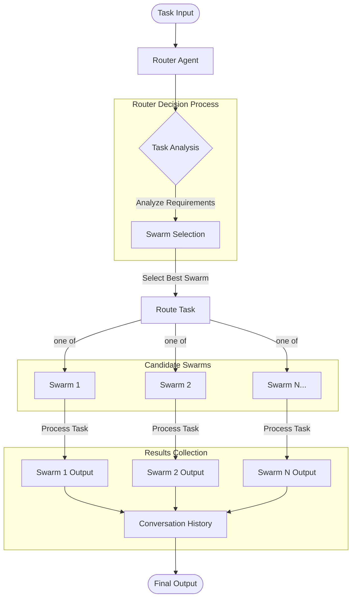

## Overview

The Hybrid Hierarchical-Cluster Swarm (HHCS) is an advanced AI orchestration architecture that combines hierarchical decision-making with parallel processing capabilities. HHCS enables complex task solving by dynamically routing tasks to specialized agent swarms based on their expertise and capabilities.

## Installation

```bash
pip install -U swarms
```

## Purpose

HHCS addresses the challenge of efficiently solving diverse and complex tasks by:

- Intelligently routing each task to the most appropriate specialized swarm
- Letting the selected swarm run its agents sequentially or in parallel, depending on its `swarm_type`
- Maintaining a clear hierarchy for effective decision-making
- Processing many independent tasks concurrently with `batched_run()`

## Architecture Diagram

The HHCS architecture follows a hierarchical structure with the router agent at the top level, specialized swarms at the middle level, and individual agents at the bottom level. Each `run()` sends the task to exactly one swarm.



## Attributes

<ParamField path="name" type="str" default="Hybrid Hierarchical-Cluster Swarm">
  The name of the swarm instance
</ParamField>

<ParamField path="description" type="str" default="A swarm that uses a hybrid hierarchical-peer model to solve complex tasks.">
  Brief description of the swarm's functionality
</ParamField>

<ParamField path="swarms" type="List[Union[SwarmRouter, Callable]]" default="[]">
  Swarms the HHCS can route tasks to. Each one needs `name`, `description`, `agents` and `swarm_type` attributes, which the constructor reads to describe the swarms in the router's system prompt, and a `run(task)` method. `SwarmRouter` instances meet this; a bare function does not
</ParamField>

<ParamField path="max_loops" type="int" default="1">
  Stored on the instance but not used. Each `run()` routes the task once
</ParamField>

<ParamField path="output_type" type="HistoryOutputType" default="list">
  Format of the conversation history returned by `run()` (e.g., "list", "dict", "str", "final", "json")
</ParamField>

<ParamField path="router_agent_model_name" type="str" default="gpt-5.4">
  LLM model used by the router agent. The router is given a `select_swarm` function schema with `reasoning`, `swarm_name` and `task_description`, and its reply is parsed into a dict, so pick a model that supports function calling
</ParamField>

## Methods

### run()

Processes a single task through the swarm system. The router agent picks a swarm and rewrites the task as a `task_description`, then the selected swarm runs that description.

```python
def run(self, task: str, *args, **kwargs)
```

**Parameters:**
- `task` (str): The task to process

**Returns:** The conversation history formatted according to `output_type` (a list by default). It holds the user's task followed by the selected swarm's output, stored under the swarm's `name`. The router's reasoning is not recorded

**Raises:** `ValueError` if `task` is empty, if the router's reply is not a string or lacks `swarm_name` or `task_description`, or if no swarm has the selected name

<Warning>
The conversation is created once in the constructor and never cleared. A second `run()` on the same instance returns the earlier tasks and outputs too. Create a new `HybridHierarchicalClusterSwarm` when each task needs a clean history.
</Warning>

### batched_run()

Calls `run()` for every task concurrently in a thread pool of `os.cpu_count() * 2` workers.

```python
def batched_run(self, tasks: List[str]) -> List[str]
```

**Parameters:**
- `tasks` (List[str]): List of task strings to process

**Returns:** List of results in task order, so `results[i]` belongs to `tasks[i]`. A task that raises yields the string `"Error processing task: <error>"` in its slot instead of stopping the batch

**Raises:** `ValueError` if `tasks` is empty

<Note>
All tasks in a batch write to the same conversation, so each result can include turns from the other tasks in the batch.
</Note>

### find_swarm_by_name()

Retrieves a swarm by its name from the available swarms.

```python
def find_swarm_by_name(self, swarm_name: str) -> SwarmRouter
```

**Parameters:**
- `swarm_name` (str): Name of the swarm to find

**Returns:** The first swarm whose `name` matches, or `None` if there is none

### route_task()

Routes a task to a specific swarm by name.

```python
def route_task(self, swarm_name: str, task_description: str) -> None
```

**Parameters:**
- `swarm_name` (str): Name of the target swarm
- `task_description` (str): The task to route

Runs the swarm and adds its output to the conversation under the swarm's `name`.

**Raises:** `ValueError` if no swarm has that name

<Note>
`get_swarms_info()` is not a method on `HybridHierarchicalClusterSwarm`. It is a standalone helper (`from swarms import get_swarms_info`) that the constructor calls internally to build the router agent's system prompt from the `swarms` list.
</Note>

## Usage Examples

### Full Legal Practice Example

```python
from swarms import Agent, HybridHierarchicalClusterSwarm, SwarmRouter

# Core Legal Agent Definitions
litigation_agent = Agent(
    agent_name="Litigator",
    system_prompt="You handle lawsuits. Analyze facts, build arguments, and develop case strategy.",
    model_name="claude-sonnet-4-6",
    max_loops=1,
)

corporate_agent = Agent(
    agent_name="Corporate-Attorney",
    system_prompt="You handle business law. Advise on corporate structure, governance, and transactions.",
    model_name="claude-sonnet-4-6",
    max_loops=1,
)

ip_agent = Agent(
    agent_name="IP-Attorney",
    system_prompt="You protect intellectual property. Handle patents, trademarks, copyrights, and trade secrets.",
    model_name="claude-sonnet-4-6",
    max_loops=1,
)

employment_agent = Agent(
    agent_name="Employment-Attorney",
    system_prompt="You handle workplace matters. Address hiring, termination, discrimination, and labor issues.",
    model_name="claude-sonnet-4-6",
    max_loops=1,
)

paralegal_agent = Agent(
    agent_name="Paralegal",
    system_prompt="You assist attorneys. Conduct research, draft documents, and organize case files.",
    model_name="claude-sonnet-4-6",
    max_loops=1,
)

doc_review_agent = Agent(
    agent_name="Document-Reviewer",
    system_prompt="You examine documents. Extract key information and identify relevant content.",
    model_name="claude-sonnet-4-6",
    max_loops=1,
)

# Practice Area Swarm Routers
litigation_swarm = SwarmRouter(
    name="litigation-practice",
    description="Handle all aspects of litigation",
    agents=[litigation_agent, paralegal_agent, doc_review_agent],
    swarm_type="SequentialWorkflow",
)

corporate_swarm = SwarmRouter(
    name="corporate-practice",
    description="Handle business and corporate legal matters",
    agents=[corporate_agent, paralegal_agent],
    swarm_type="SequentialWorkflow",
)

ip_swarm = SwarmRouter(
    name="ip-practice",
    description="Handle intellectual property matters",
    agents=[ip_agent, paralegal_agent],
    swarm_type="SequentialWorkflow",
)

employment_swarm = SwarmRouter(
    name="employment-practice",
    description="Handle employment and labor law matters",
    agents=[employment_agent, paralegal_agent],
    swarm_type="SequentialWorkflow",
)

# Cross-functional Swarm Routers
m_and_a_swarm = SwarmRouter(
    name="mergers-acquisitions",
    description="Handle mergers and acquisitions",
    agents=[
        corporate_agent,
        ip_agent,
        employment_agent,
        doc_review_agent,
    ],
    swarm_type="ConcurrentWorkflow",
)

dispute_swarm = SwarmRouter(
    name="dispute-resolution",
    description="Handle complex disputes requiring multiple specialties",
    agents=[litigation_agent, corporate_agent, doc_review_agent],
    swarm_type="ConcurrentWorkflow",
)

# Create the HHCS
hybrid_hierarchical_swarm = HybridHierarchicalClusterSwarm(
    name="hybrid-hierarchical-swarm",
    description="A hybrid hierarchical swarm that uses a hybrid hierarchical peer model to solve complex tasks.",
    swarms=[
        litigation_swarm,
        corporate_swarm,
        ip_swarm,
        employment_swarm,
        m_and_a_swarm,
        dispute_swarm,
    ],
    max_loops=1,
    router_agent_model_name="claude-sonnet-4-6",
)

# Run a task
result = hybrid_hierarchical_swarm.run(
    "What is the best way to file for a patent for AI technology?"
)
print(result)
```

## Features

- **Router-based task distribution**: Central router agent analyzes incoming tasks and directs each one to a single specialized swarm
- **Hybrid architecture**: Combines hierarchical control with clustered specialization
- **Batch concurrency**: `batched_run()` processes many tasks in parallel, each routed independently
- **Flexible swarm types**: Supports both sequential and concurrent workflows within swarms
- **Conversation history**: Records each task and the selected swarm's output

## How It Works

1. **Task Input**: A task is submitted to the HHCS
2. **Router Analysis**: The router agent analyzes the task requirements
3. **Swarm Selection**: The router calls `select_swarm` with a swarm name and a rewritten task description
4. **Task Routing**: The task description is routed to the selected swarm for processing
5. **Swarm Execution**: The selected swarm's agents process the task (sequentially or concurrently depending on swarm type)
6. **Result Collection**: The swarm's output is added to the conversation history
7. **Final Output**: The conversation history is returned in the `output_type` format

## Source Code

View the [source code on GitHub](https://github.com/kyegomez/swarms/blob/master/swarms/structs/hybrid_hiearchical_peer_swarm.py)
