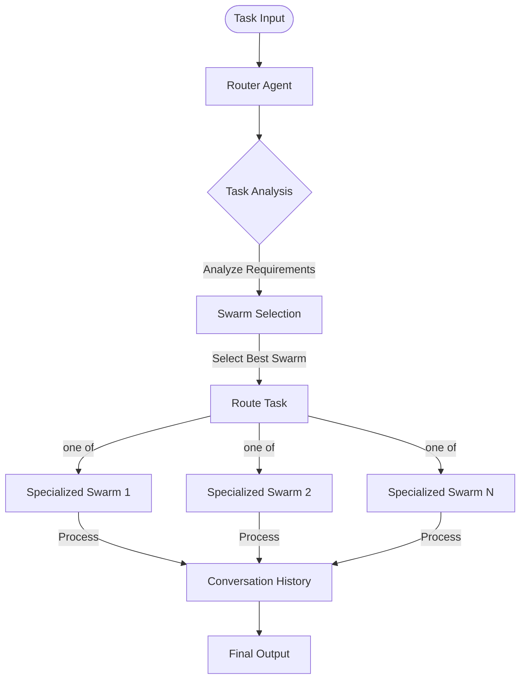
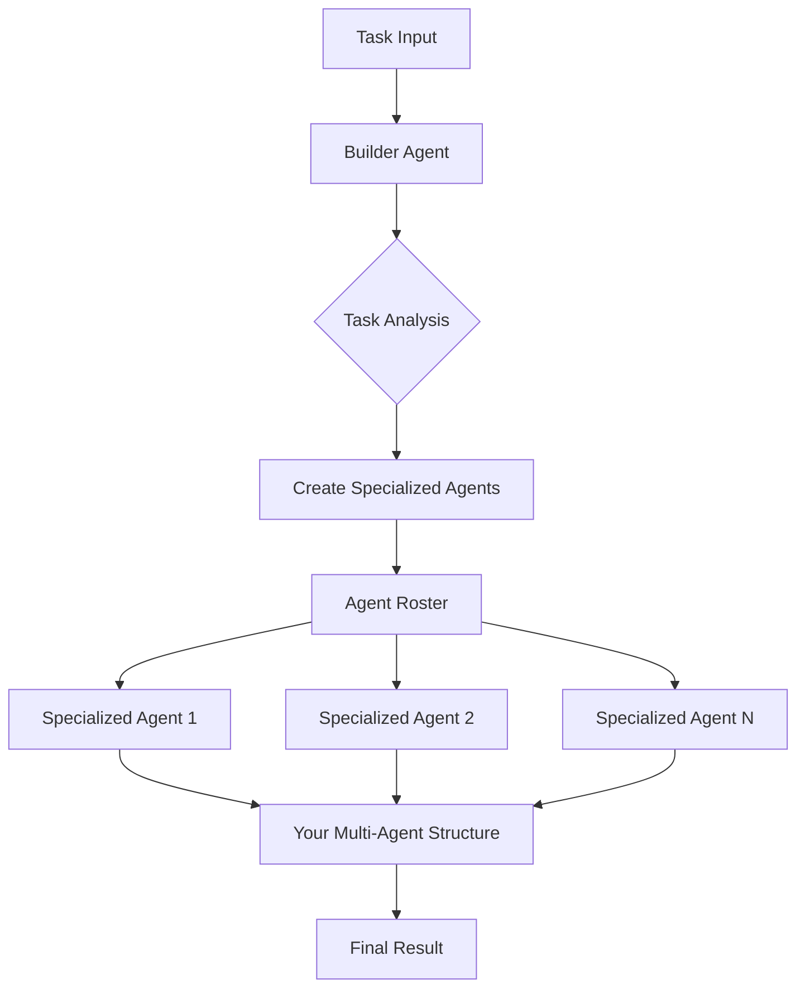
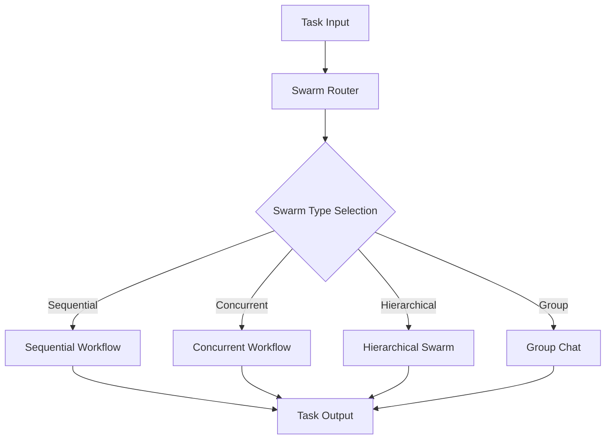

## Overview

Hierarchical agent orchestration involves organizing multiple agents in structured layers to efficiently handle complex tasks. There are several key architectures available, each with distinct characteristics and use cases.

## Installation

```bash
pip install -U swarms
```

## Architecture Comparison

| Architecture | Strengths | Weaknesses |
|--------------|-----------|------------|
| HHCS | Clear task routing, specialized swarm handling, concurrent batch processing, good for complex multi-domain tasks | More complex setup, overhead in routing, requires careful swarm design |
| Auto Agent Builder | Dynamic agent creation, task-specific system prompts and models, good for evolving tasks | Extra LLM call to design the team, roster quality depends on the builder model, you still choose how to run the agents |
| SwarmRouter | Multiple workflow types, simple configuration, flexible deployment, good for varied task types | Less specialized than HHCS, limited inter-swarm communication, may require manual type selection |

## Core Architectures

### Hybrid Hierarchical-Cluster Swarm (HHCS)

Hybrid Hierarchical-Cluster Swarm (HHCS) is an architecture that uses a Router Agent to analyze and distribute tasks to other swarms.

- Each task is routed to one specialized swarm based on its requirements
- `batched_run()` routes many tasks concurrently, each to its own swarm
- Ideal for complex, multi-domain tasks and enterprise-scale operations
- Provides clear task routing but requires more complex setup



### Auto Agent Builder

Auto Agent Builder (`AutoAgentBuilder`) is a dynamic agent architecture that creates specialized agents on demand.

- A builder agent analyzes the task and designs a roster of up to `max_agents` agents (default 5), each with its own name, description, system prompt and model
- `run()` returns constructed `Agent` objects, or the raw configuration dicts when `return_dict=True`
- It does not run the agents. Hand them to a structure such as `SwarmRouter` or `HierarchicalSwarm` to execute the task
- Best suited for evolving requirements and dynamic workloads



```python
from swarms import AutoAgentBuilder, SwarmRouter

task = "Evaluate whether a mid-size retailer should build or buy its e-commerce platform."

agents = AutoAgentBuilder(model_name="gpt-5.4", max_agents=3).run(task)

router = SwarmRouter(agents=agents, swarm_type="SequentialWorkflow")
result = router.run(task)
```

### SwarmRouter

SwarmRouter is a flexible system supporting multiple swarm architectures through a simple interface. You pick the architecture with `swarm_type`, including:

- Sequential workflows
- Concurrent workflows
- Hierarchical swarms
- Group chat interactions
- Mixture of agents, majority voting, debate, council and planner-worker patterns

It is simpler to configure and deploy than the other architectures here, and best for general-purpose tasks and smaller scale operations. See [SwarmRouter](/api/swarm-router) for every `swarm_type`.



## Use Case Recommendations

### HHCS

Best for:
- Enterprise-scale operations
- Multi-domain problems
- Complex task routing
- Parallel processing needs

### Auto Agent Builder

Best for:
- Dynamic workloads
- Evolving requirements
- Research and development
- Exploratory tasks

### SwarmRouter

Best for:
- General purpose tasks
- Quick deployment
- Mixed workflow types
- Smaller scale operations

## Best Practices for Selection

### Evaluate Task Complexity

- Simple tasks: SwarmRouter
- Complex, multi-domain tasks: HHCS
- Dynamic, evolving tasks: Auto Agent Builder

### Consider Scale

- Small scale: SwarmRouter
- Large scale: HHCS
- Variable scale: Auto Agent Builder

### Resource Availability

- Limited resources: SwarmRouter
- Abundant resources: HHCS or Auto Agent Builder
- Dynamic resources: Auto Agent Builder

### Development Time

- Quick deployment: SwarmRouter
- Complex system: HHCS
- Experimental system: Auto Agent Builder

## Related Documentation

- [Hybrid Hierarchical-Cluster Swarm (HHCS)](/api/hhcs)
- [SwarmRouter](/api/swarm-router)
- [Auto Agent Builder](/api/auto-agent-builder)
- [Auto Swarm Builder](/api/auto-swarm-builder)
